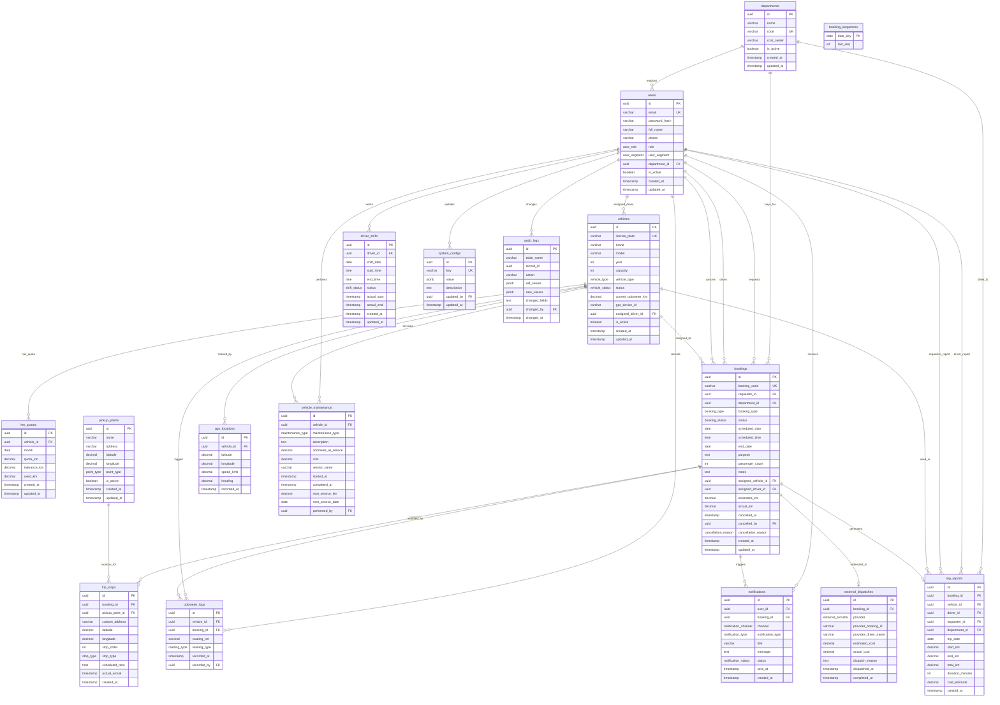

# MSM Car Booking - Entity Relationship Diagram



## Diagram Legend

| Symbol | Meaning |
|--------|---------|
| `PK` | Primary Key |
| `FK` | Foreign Key |
| `UK` | Unique Key |
| `||--o{` | One-to-Many relationship |
| `||--o|` | One-to-One (optional) relationship |

## Entity Groups

### Core Entities
| Table | Description |
|-------|-------------|
| `departments` | Organizational units for cost tracking |
| `users` | All system users (admins, drivers, employees) |
| `vehicles` | Fleet vehicles with GPS tracking |
| `km_quotas` | Monthly kilometer quotas per vehicle |
| `pickup_points` | Predefined and custom locations |

### Booking System
| Table | Description |
|-------|-------------|
| `bookings` | Main reservation records |
| `trip_stops` | Individual stops within bookings |
| `external_dispatches` | Records for Grab/Taxi redirects |
| `booking_sequences` | Thread-safe booking code generation |

### Tracking & GPS
| Table | Description |
|-------|-------------|
| `gps_locations` | Real-time vehicle positions (partitioned) |
| `odometer_logs` | Distance readings for trips |

### Operations
| Table | Description |
|-------|-------------|
| `driver_shifts` | Driver schedules and availability |
| `vehicle_maintenance` | Service and repair history |
| `notifications` | Multi-channel notification queue |

### Reporting & Audit
| Table | Description |
|-------|-------------|
| `trip_reports` | Denormalized analytics data |
| `system_configs` | JSONB key-value configuration |
| `audit_logs` | Change tracking for critical tables |

## Enum Types

```sql
-- User & Access
user_role: ADMIN, PIC, GA, DRIVER, EMPLOYEE
user_segment: DAILY, SOMETIMES

-- Vehicles
vehicle_type: SEDAN, SUV, VAN, BUS
vehicle_status: AVAILABLE, IN_USE, MAINTENANCE, INACTIVE

-- Locations
point_type: FIXED, FLEXIBLE

-- Bookings
booking_type: SINGLE_TRIP, MULTI_STOP, BLOCK_SCHEDULE
booking_status: PENDING, CONFIRMED, ASSIGNED, IN_PROGRESS, COMPLETED, CANCELLED, REDIRECTED_EXTERNAL
stop_type: PICKUP, DROP, STOP
cancellation_reason: USER_REQUEST, NO_VEHICLE_AVAILABLE, NO_DRIVER_AVAILABLE, QUOTA_EXCEEDED, VEHICLE_BREAKDOWN, SCHEDULE_CONFLICT, WEATHER, EMERGENCY, DUPLICATE, OTHER

-- External Providers
external_provider: GRAB, GOJEK, BE, TAXI_MAI_LINH, TAXI_VINASUN, OTHER

-- Operations
reading_type: TRIP_START, TRIP_END, DAILY_CHECK
shift_status: SCHEDULED, ACTIVE, COMPLETED, ABSENT, CANCELLED
maintenance_type: SCHEDULED, REPAIR, INSPECTION, TIRE_SERVICE, OIL_CHANGE, CLEANING, OTHER

-- Notifications
notification_channel: APP_PUSH, AUTO_CALL, SMS
notification_type: BOOKING_CONFIRMED, VEHICLE_ARRIVING, TRIP_STARTED, TRIP_COMPLETED, BOOKING_CANCELLED
notification_status: PENDING, SENT, DELIVERED, FAILED
```
