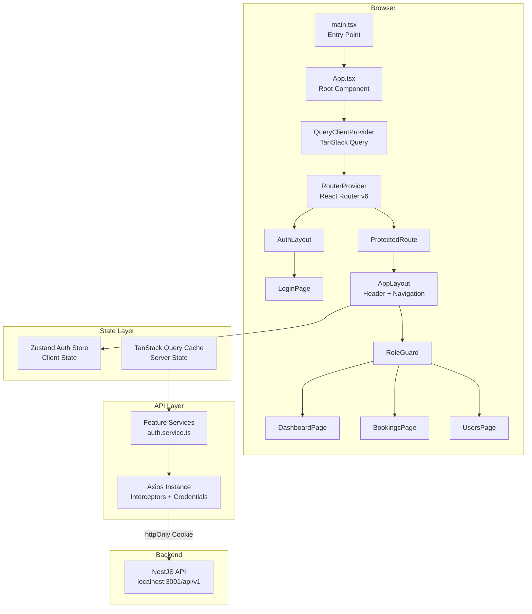
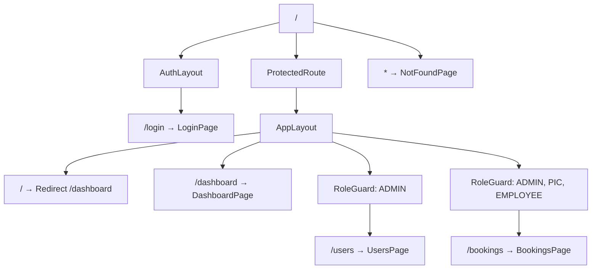

# Frontend Architecture

Deep-dive into the MSM Car Booking frontend architecture, including application layers, data flow patterns, state management, and component design.

**Last Updated:** 2026-02-03

---

## High-Level Architecture



---

## Application Layers

The frontend is structured in four distinct layers, each with a clear responsibility:

```
┌─────────────────────────────────────────────────┐
│  Presentation Layer                             │
│  Pages, Layouts, UI Components                  │
├─────────────────────────────────────────────────┤
│  Hook Layer                                     │
│  useAuth, useLogin, custom hooks                │
├─────────────────────────────────────────────────┤
│  State Layer                                    │
│  Zustand (client state) + TanStack Query (server│
│  state)                                         │
├─────────────────────────────────────────────────┤
│  Service Layer                                  │
│  Axios instance, feature services               │
└─────────────────────────────────────────────────┘
```

| Layer | Responsibility | Key Files |
|-------|---------------|-----------|
| **Presentation** | Renders UI, handles user interaction | `features/*/pages/`, `components/layout/`, `components/ui/` |
| **Hook** | Encapsulates business logic, connects state to UI | `features/*/hooks/` |
| **State** | Manages client and server state | `features/*/store/`, `config/query-client.ts` |
| **Service** | HTTP communication with backend | `features/*/services/`, `lib/axios.ts` |

---

## Feature-Based Module Structure

Each feature is a self-contained module following a consistent internal structure:

```
features/<feature>/
├── components/     # Feature-specific components
├── hooks/          # Custom hooks (data fetching, business logic)
├── pages/          # Route-level page components
├── services/       # API service functions
├── store/          # Zustand stores (if needed)
├── types/          # Feature-specific TypeScript types
└── index.ts        # Public API (barrel exports)
```

### Module Boundaries

- Features **only export** through their `index.ts` barrel file
- Cross-feature imports use the barrel export: `import { useAuth } from '@/features/auth'`
- Shared utilities live in `lib/`, `constants/`, and `types/` at the src root
- UI primitives (shadcn/ui) live in `components/ui/`

### Current Features

| Feature | Module | Status | Internal Structure |
|---------|--------|--------|--------------------|
| Auth | `features/auth/` | Complete | components, hooks, pages, services, store, types |
| Dashboard | `features/dashboard/` | Placeholder | pages only |
| Bookings | `features/bookings/` | Placeholder | pages only |
| Users | `features/users/` | Placeholder | pages only |

---

## Routing Architecture

Routing uses React Router v6 with `createBrowserRouter` for data-aware routing.

### Route Tree



### Route Protection Strategy

Protection is implemented as a two-layer system using React Router's nested `<Outlet />` pattern:

1. **`ProtectedRoute`** — Checks `isAuthenticated` from Zustand store. Redirects to `/login` if not authenticated. Shows loading spinner during auth initialization.

2. **`RoleGuard`** — Checks `user.role` against `allowedRoles` prop. Redirects to `/dashboard` (or custom `fallbackPath`) if role is not permitted.

```
<ProtectedRoute>          ← Layer 1: Auth check
  <AppLayout>             ← Shared chrome (header, nav)
    <RoleGuard>           ← Layer 2: Role check
      <Page />            ← Actual content
    </RoleGuard>
  </AppLayout>
</ProtectedRoute>
```

### Role Permission Map

Defined in `src/constants/roles.ts`:

| Route | ADMIN | PIC | GA | DRIVER | EMPLOYEE |
|-------|-------|-----|----|--------|----------|
| `/dashboard` | Yes | Yes | Yes | Yes | Yes |
| `/users` | Yes | - | - | - | - |
| `/bookings` | Yes | Yes | - | - | Yes |
| `/vehicles` | Yes | Yes | - | - | - |

---

## State Management

### Dual State Strategy

The frontend separates **client state** (Zustand) from **server state** (TanStack Query):

| Concern | Tool | Purpose |
|---------|------|---------|
| Auth state | **Zustand** | Current user, authentication status, loading state |
| Server data | **TanStack Query** | API responses, caching, background refetch |
| Form state | **React Hook Form** | Form values, validation, submission |
| UI state | **React `useState`** | Local component state (modals, toggles) |

### Zustand Auth Store

The auth store (`features/auth/store/auth.store.ts`) manages authentication lifecycle:

```typescript
interface AuthState {
  user: User | null;
  isAuthenticated: boolean;
  isLoading: boolean;
  setUser: (user: User) => void;
  clearAuth: () => Promise<void>;
  initialize: () => Promise<void>;
}
```

**Initialization flow:**
1. `App.tsx` calls `initialize()` on mount
2. Checks localStorage for cached user data (instant UI)
3. Validates session with `GET /auth/me` (cookie auto-sent)
4. If valid, refreshes user data; if invalid, clears state

**Persistence:** User data is cached in `localStorage` under key `auth-user` for instant UI hydration. The JWT token itself is never stored in the frontend — it lives in an httpOnly cookie.

### TanStack Query Configuration

Defined in `src/config/query-client.ts`:

| Setting | Value | Purpose |
|---------|-------|---------|
| `staleTime` | 5 minutes | Data considered fresh for 5 min |
| `gcTime` | 10 minutes | Unused cache kept for 10 min |
| `retry` | 1 | Single retry on failure |
| `refetchOnWindowFocus` | false | No refetch on tab switch |

---

## API Layer

### Axios Instance

Configured in `src/lib/axios.ts`:

- **Base URL:** `/api/v1` (proxied to backend in development)
- **Credentials:** `withCredentials: true` (sends httpOnly cookies)
- **Content-Type:** `application/json`

### Response Interceptor

The 401 interceptor handles session expiry:

```
On 401 response:
  ├── If login request → pass through (show error on form)
  ├── If /auth/me request → pass through (handled by store)
  └── Otherwise → clear localStorage, redirect to /login
```

### Vite Dev Server Proxy

The Vite dev server proxies API requests to avoid CORS in development:

```typescript
// vite.config.ts
server: {
  port: 3000,
  proxy: {
    '/api': {
      target: 'http://localhost:3001',
      changeOrigin: true,
    },
  },
}
```

### Service Pattern

Each feature defines a service object with typed API calls:

```typescript
// features/auth/services/auth.service.ts
export const authService = {
  async login(credentials: LoginCredentials): Promise<LoginResponse> {
    const { data } = await apiClient.post<LoginResponse>('/auth/login', credentials);
    return data;
  },
  // ...
};
```

### API Type Contracts

Shared response types in `src/types/api.types.ts`:

```typescript
interface ApiErrorResponse {
  statusCode: number;
  message: string | string[];
  error: string;
}

interface PaginatedResponse<T> {
  data: T[];
  total: number;
  page: number;
  limit: number;
  totalPages: number;
}
```

---

## Component Architecture

### Layout Hierarchy

```
<App>
  <QueryClientProvider>
    <RouterProvider>
      ├── <AuthLayout>        → Centered container for login
      │     └── <LoginPage>
      │
      └── <ProtectedRoute>    → Auth guard
            └── <AppLayout>   → Sticky header + nav + <main>
                  └── <Outlet> → Page content
```

### Layout Components

| Component | File | Responsibility |
|-----------|------|---------------|
| `AuthLayout` | `components/layout/AuthLayout.tsx` | Centered flex container for unauthenticated pages |
| `AppLayout` | `components/layout/AppLayout.tsx` | Sticky glass header with navigation links, user display, sign out button, and `<main>` content area |

### UI Components (shadcn/ui)

Installed shadcn/ui components in `src/components/ui/`:

| Component | Source | Usage |
|-----------|--------|-------|
| `Button` | shadcn/ui | Actions, form submission |
| `Card` | shadcn/ui | Content containers (glass-card) |
| `Input` | shadcn/ui | Form text inputs |
| `Label` | shadcn/ui | Form field labels |
| `Sonner` | shadcn/ui | Toast notifications |

### Glassmorphism Design System

All visual styling is controlled through CSS custom properties in `src/index.css`:

| Token | Default | Controls |
|-------|---------|----------|
| `--glass-opacity` | `0.08` | Background transparency |
| `--glass-blur` | `16px` | Backdrop blur intensity |
| `--glass-border-opacity` | `0.12` | Border visibility |
| `--glass-shadow` | `0 8px 32px rgba(0,0,0,0.4)` | Elevation shadow |

Utility classes: `glass`, `glass-card`, `glass-card-info`, `glass-card-success`, `glass-card-warning`, `glass-card-danger`, `glass-card-purple`

---

## Form Architecture

Forms use React Hook Form + Zod for validation:

```
┌────────────────┐     ┌──────────────┐     ┌──────────────┐
│ Zod Schema     │────▶│ zodResolver  │────▶│ useForm()    │
│ (validation)   │     │ (bridge)     │     │ (form state) │
└────────────────┘     └──────────────┘     └──────┬───────┘
                                                    │
                                             ┌──────▼───────┐
                                             │ handleSubmit  │
                                             │ register()    │
                                             │ formState     │
                                             └──────┬───────┘
                                                    │
                                             ┌──────▼───────┐
                                             │ TanStack     │
                                             │ useMutation  │
                                             └──────────────┘
```

**Key pattern:** Zod v4 is imported via `zod/v4` subpath due to the v4 module structure:

```typescript
import { z } from 'zod/v4';
```

---

## Type System

### Enum Pattern

TypeScript `enum` keyword is not used due to `erasableSyntaxOnly` in tsconfig. Instead, `as const` objects provide type-safe enums:

```typescript
export const UserRole = {
  ADMIN: 'ADMIN',
  PIC: 'PIC',
  // ...
} as const;
export type UserRole = (typeof UserRole)[keyof typeof UserRole];
```

### Defined Enums

| Enum | File | Values |
|------|------|--------|
| `UserRole` | `types/enums.ts` | ADMIN, PIC, GA, DRIVER, EMPLOYEE |
| `UserSegment` | `types/enums.ts` | DAILY, SOMETIMES |
| `PositionLevel` | `types/enums.ts` | STAFF → C_LEVEL (8 levels) |
| `VehicleType` | `types/enums.ts` | SEDAN, SUV, VAN, BUS |
| `VehicleStatus` | `types/enums.ts` | AVAILABLE, IN_USE, MAINTENANCE, INACTIVE |
| `BookingType` | `types/enums.ts` | SINGLE_TRIP, MULTI_STOP, BLOCK_SCHEDULE |
| `BookingStatus` | `types/enums.ts` | PENDING_APPROVAL → REDIRECTED_EXTERNAL (8 statuses) |
| `ApprovalType` | `types/enums.ts` | MANAGER_APPROVAL, CC_ONLY, AUTO_APPROVED |
| `ApprovalStatus` | `types/enums.ts` | PENDING → EXPIRED (5 statuses) |
| `NotificationType` | `types/enums.ts` | 12 notification types |
| `ExternalProvider` | `types/enums.ts` | GRAB, GOJEK, BE, TAXI_MAI_LINH, TAXI_VINASUN, OTHER |

---

## Build & Dev Tooling

### Vite Configuration

| Setting | Value |
|---------|-------|
| Build tool | Vite 7 |
| React plugin | `@vitejs/plugin-react` (SWC) |
| CSS | `@tailwindcss/vite` plugin |
| Path alias | `@ → ./src` |
| Dev port | 3000 |
| API proxy | `/api → http://localhost:3001` |

### TypeScript Configuration

| Setting | Value |
|---------|-------|
| Target | ES2022 |
| Module | ESNext |
| Module resolution | Bundler |
| JSX | react-jsx |
| Strict mode | Enabled |
| `erasableSyntaxOnly` | Enabled (no `enum` keyword) |
| `verbatimModuleSyntax` | Enabled |

---

## Testing Architecture

### E2E Tests (Playwright)

Tests live in `frontend/e2e/` and cover authentication flows, route protection, and role-based access.

**Configuration** (`playwright.config.ts`):
- Parallel execution with 5 browser projects (Chromium, Firefox, WebKit, Mobile Chrome, Mobile Safari)
- Auto-starts Vite dev server before tests
- Screenshots on failure, video and trace on first retry
- CI mode: single worker, 2 retries

**Auth Fixtures** (`e2e/fixtures/auth.fixture.ts`):
- Pre-configured authenticated page contexts per role
- `authenticatedPage`, `adminPage`, `picPage`, `driverPage`, `employeePage`
- Uses seed data credentials for login

**Test Suites:**

| Suite | File | Coverage |
|-------|------|----------|
| Smoke | `smoke.spec.ts` | Dev server health, HTML structure |
| Auth | `auth.spec.ts` | Login form, validation, protected routes, role access, logout |

---

## Security Considerations

| Concern | Implementation |
|---------|---------------|
| **Token storage** | httpOnly cookie (never in JS/localStorage) |
| **Session validation** | `GET /auth/me` on app init, 401 interceptor for expiry |
| **XSS prevention** | React auto-escaping, no `dangerouslySetInnerHTML` |
| **CSRF protection** | `sameSite: 'strict'` cookie attribute |
| **CORS** | Configured for trusted origins with `credentials: true` |
| **User data cache** | Only user profile in localStorage (no tokens or secrets) |

---

## Shared Utilities

| Module | File | Functions |
|--------|------|-----------|
| Class merging | `lib/utils.ts` | `cn()` — merges Tailwind classes with `clsx` + `tailwind-merge` |
| HTTP client | `lib/axios.ts` | `apiClient` — configured Axios instance |
| Formatting | `lib/formatters.ts` | `formatCurrency()` (VND), `formatDate()`, `formatDateTime()` |
| UUID | `lib/uuid.ts` | `isValidUuid()`, `sanitizeUuid()` |
| Status styles | `constants/statusStyles.ts` | `BOOKING_STATUS_STYLES` — badge colors per booking status |
| Role config | `constants/roles.ts` | `ROUTE_PERMISSIONS`, `DEFAULT_ROUTE_BY_ROLE` |
