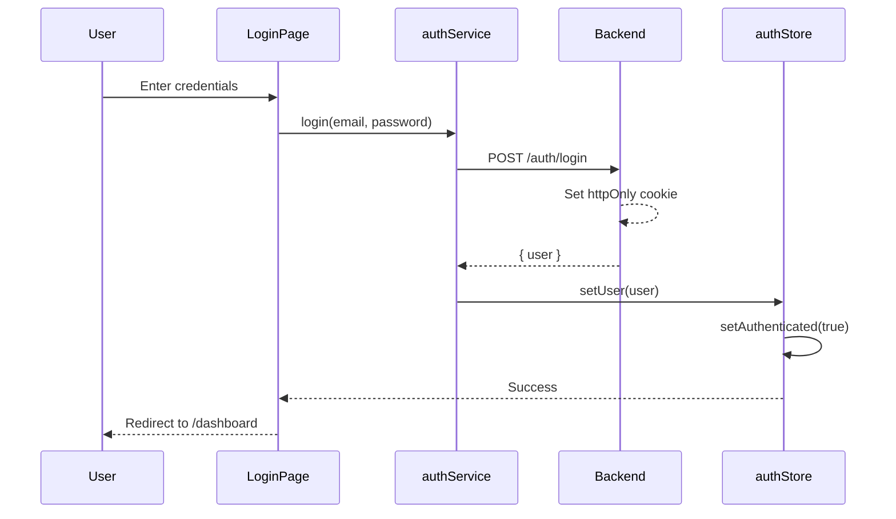
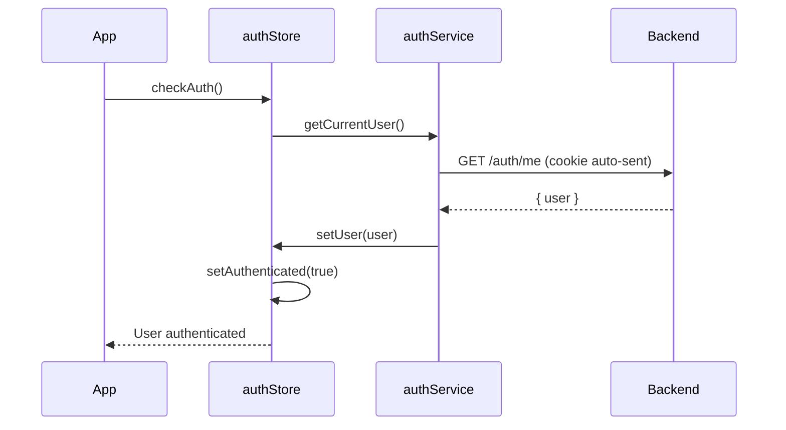
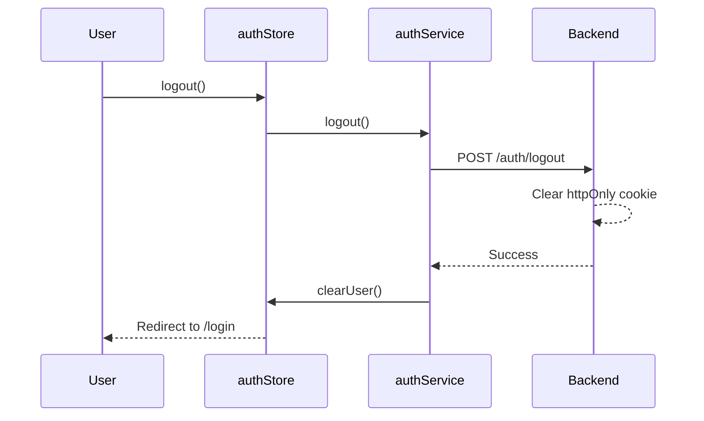

# Frontend Documentation

React-based web application for the MSM Car Booking system with httpOnly cookie authentication.

**Last Updated:** 2026-02-03

## Architecture

- **Framework:** React 19 with TypeScript 5.9
- **Build Tool:** Vite 7
- **Styling:** Tailwind CSS 4 + shadcn/ui (new-york style)
- **State Management:** Zustand 5 (auth store)
- **Data Fetching:** Axios + TanStack Query v5
- **Forms:** React Hook Form 7 + Zod v4
- **Routing:** React Router v7
- **Notifications:** Sonner (toast)
- **Icons:** Lucide React
- **Testing:** Playwright (E2E)

## Documentation Index

### Design System

- **[Design System](/docs/frontend/design-system)** - Glassmorphism theme, utility classes, and UI components

### Architecture

- **[Frontend Structure](#frontend-structure)** - Feature-based folder organization
- **[Authentication Flow](#authentication-flow)** - Cookie-based JWT authentication with Zustand
- **[Tech Stack Details](#tech-stack-details)** - Complete list of dependencies

---

## Implementation Status

### Pages & Features

| Page/Feature | Status | Location | Notes |
|-------------|--------|----------|-------|
| **Login** | Done | `features/auth/` | Full Zod validation, httpOnly cookie auth, auto-redirect by role |
| **App Layout** | Done | `components/layout/AppLayout.tsx` | Sticky header, navigation, user display, sign out |
| **Auth Layout** | Done | `components/layout/AuthLayout.tsx` | Centered container for login |
| **Protected Routes** | Done | `features/auth/components/ProtectedRoute.tsx` | Auth guard with loading state |
| **Role Guard** | Done | `features/auth/components/RoleGuard.tsx` | Role-based route access |
| **404 Page** | Done | `pages/NotFoundPage.tsx` | Not found handler |
| **Dashboard** | Placeholder | `features/dashboard/pages/DashboardPage.tsx` | Welcome message only |
| **Bookings** | Placeholder | `features/bookings/pages/BookingsPage.tsx` | Title and description only |
| **User Management** | Placeholder | `features/users/pages/UsersPage.tsx` | Title and description only |
| Vehicle Management | Not Started | - | No pages or components |
| Chat System | Not Started | - | Backend fully built, needs UI |
| Driver Shift Management | Not Started | - | Backend fully built (13 endpoints), needs UI |
| Approval Management | Not Started | - | Backend fully built (7 endpoints), needs UI |
| Notification Inbox | Not Started | - | Backend has basic endpoints |
| Reports/Analytics | Not Started | - | No backend module either |
| GPS Tracking Map | Not Started | - | Backend has read endpoints |
| System Configuration | Not Started | - | No backend endpoints either |
| Pickup Point Management | Not Started | - | No backend endpoints either |

### Infrastructure (Done)

| Component | Status | Description |
|-----------|--------|-------------|
| Auth Store | Done | Zustand store with localStorage hydration + /auth/me validation |
| Axios Instance | Done | Base URL `/api/v1`, credentials, 401 interceptor |
| Query Client | Done | TanStack Query with 5min stale, 10min gc, 1 retry |
| UI Components | Done | Button, Card, Input, Label, Sonner (shadcn/ui) |
| Design System | Done | Glassmorphism theme with oklch colors |
| Type System | Done | Enums, user types, API response types |
| Utilities | Done | Formatters (currency/date), UUID validation, cn() helper |
| Status Styles | Done | Booking status color mapping |
| Role Permissions | Done | Route permissions map, default routes by role |
| Path Aliases | Done | `@/` prefix for imports |
| E2E Testing | Done | Playwright with auth fixtures |

---

## Frontend Structure

The frontend follows a **feature-based architecture** for scalability and maintainability:

```
frontend/src/
├── components/
│   ├── ui/              # shadcn/ui components (Button, Input, Card, Label, Sonner)
│   └── layout/          # Layout components
│       ├── AuthLayout.tsx       # Layout for login page
│       └── AppLayout.tsx        # Main app layout with navigation header
│
├── config/
│   ├── query-client.ts  # TanStack Query configuration
│   └── routes.tsx       # Route configuration with role-based access
│
├── constants/
│   ├── roles.ts         # Route permissions map + default routes by role
│   └── statusStyles.ts  # Booking status badge color mappings
│
├── features/            # Feature modules (each is self-contained)
│   ├── auth/
│   │   ├── components/  # LoginForm, ProtectedRoute, RoleGuard
│   │   ├── hooks/       # useAuth, useLogin
│   │   ├── pages/       # LoginPage
│   │   ├── services/    # auth.service.ts (login, logout, getMe)
│   │   ├── store/       # auth.store.ts (Zustand)
│   │   └── types/       # auth.types.ts
│   │
│   ├── dashboard/
│   │   └── pages/       # DashboardPage (placeholder)
│   │
│   ├── users/
│   │   └── pages/       # UsersPage (placeholder)
│   │
│   └── bookings/
│       └── pages/       # BookingsPage (placeholder)
│
├── lib/
│   ├── axios.ts         # Axios instance with interceptors
│   ├── utils.ts         # cn() helper for Tailwind class merging
│   ├── formatters.ts    # formatCurrency, formatDate, formatDateTime
│   └── uuid.ts          # isValidUuid, sanitizeUuid
│
├── pages/
│   └── NotFoundPage.tsx # 404 page
│
├── types/
│   ├── enums.ts         # UserRole, BookingStatus, VehicleStatus, etc.
│   ├── user.types.ts    # User interface
│   └── api.types.ts     # API response types
│
├── App.tsx              # Root component with QueryClientProvider
├── main.tsx             # Entry point
└── index.css            # Global styles + glassmorphism theme
```

### Current Routes

| Route | Access | Component | Status |
|-------|--------|-----------|--------|
| `/login` | Public | LoginPage | Done |
| `/dashboard` | All authenticated | DashboardPage | Placeholder |
| `/bookings` | ADMIN, PIC, EMPLOYEE | BookingsPage | Placeholder |
| `/users` | ADMIN | UsersPage | Placeholder |
| `*` | - | NotFoundPage | Done |

---

## Authentication Flow

The frontend uses **httpOnly cookie-based JWT authentication** for security:

### Login Flow



**Key Points:**
- JWT token is **NOT** stored in frontend code or localStorage
- Token is automatically included in requests via httpOnly cookie
- Frontend only stores user data (no sensitive tokens)

### Session Validation Flow



**On App Initialization:**
1. `App.tsx` calls `authStore.checkAuth()` on mount
2. Backend validates JWT from httpOnly cookie
3. If valid, user data is loaded
4. If invalid, user is redirected to login

### Logout Flow



### Protected Routes

Routes are protected using `ProtectedRoute` + `RoleGuard` components:

```typescript
// ProtectedRoute checks authentication
// RoleGuard checks role-based access within protected routes
```

**Role-Based Access:**
- `/dashboard` - All authenticated users
- `/users` - ADMIN only
- `/bookings` - ADMIN, PIC, EMPLOYEE

---

## Tech Stack Details

### Core Dependencies

| Package | Version | Purpose |
|---------|---------|---------|
| `react` | 19.2.0 | UI library with automatic memoization |
| `react-dom` | 19.2.0 | DOM bindings |
| `typescript` | 5.9.3 | Type safety |
| `vite` | 7.2.4 | Build tool and dev server |

### Routing & State

| Package | Version | Purpose |
|---------|---------|---------|
| `react-router-dom` | 6.30.3 | Client-side routing |
| `zustand` | 5.0.10 | Lightweight state management (auth store) |

### Data Fetching

| Package | Version | Purpose |
|---------|---------|---------|
| `axios` | 1.13.4 | HTTP client with interceptors |
| `@tanstack/react-query` | 5.90.20 | Server state management, caching |

### Forms & Validation

| Package | Version | Purpose |
|---------|---------|---------|
| `react-hook-form` | 7.71.1 | Performant form management |
| `zod` | 4.3.6 | Schema validation |
| `@hookform/resolvers` | 5.2.2 | Zod resolver for React Hook Form |

### UI Components

| Package | Version | Purpose |
|---------|---------|---------|
| `@radix-ui/*` | 1.4.3 | Unstyled, accessible UI primitives |
| `tailwindcss` | 4.1.18 | Utility-first CSS framework |
| `tailwind-merge` | 3.4.0 | Merge Tailwind classes without conflicts |
| `clsx` | 2.1.1 | Conditional className utility |
| `class-variance-authority` | 0.7.1 | Type-safe component variants |
| `lucide-react` | 0.563.0 | Icon library |
| `sonner` | 2.0.7 | Toast notifications |

### Development Tools

| Package | Version | Purpose |
|---------|---------|---------|
| `@vitejs/plugin-react-swc` | 3.7.2 | Fast React refresh with SWC |
| `eslint` | 9.39.1 | Code linting |
| `@playwright/test` | 1.58.1 | E2E testing |

---

## Path Aliases

TypeScript and Vite are configured with `@/` path alias:

```typescript
// Instead of:
import { Button } from '../../components/ui/button';

// Use:
import { Button } from '@/components/ui/button';
```

## Environment Variables

Frontend environment variables are prefixed with `VITE_`:

```env
VITE_API_URL=http://localhost:3001/api/v1
```

## Development Workflow

```bash
pnpm install    # Install dependencies
pnpm dev        # Start development server
pnpm build      # Build for production
pnpm preview    # Preview production build
pnpm lint       # Lint code
pnpm format     # Format code
pnpm test:e2e   # Run Playwright tests
```

## Design Principles

### 1. React 19 Automatic Memoization

React 19 Compiler handles memoization automatically:

```typescript
// DO NOT use useCallback/useMemo (React 19 handles this)
const handleSubmit = () => { ... };
```

### 2. Enum Usage

Use `as const` objects instead of TypeScript `enum` (due to TS 5.9 `erasableSyntaxOnly`):

```typescript
export const UserRole = {
  ADMIN: 'ADMIN',
  PIC: 'PIC',
  EMPLOYEE: 'EMPLOYEE',
} as const;

export type UserRole = (typeof UserRole)[keyof typeof UserRole];
```

### 3. Styling Conventions

Follow the glassmorphism design system:

```tsx
<div className="glass-card p-4">
  {/* Content */}
</div>

<div className="grid grid-cols-1 sm:grid-cols-2 gap-4">
  {/* Responsive form fields */}
</div>
```

## Security Considerations

- **XSS Prevention:** React auto-escaping + httpOnly cookies prevent token theft
- **CSRF Protection:** `sameSite: 'strict'` cookie attribute
- **CORS:** Configured to allow only trusted origins with `credentials: true`
- **No `dangerouslySetInnerHTML`** usage

## Related Documentation

- [Design System](/docs/frontend/design-system)
- [Implementation Status](../implementation-status.md)
- [Backend API](/docs/backend/)
- [Backend Security](../backend/security.md)
