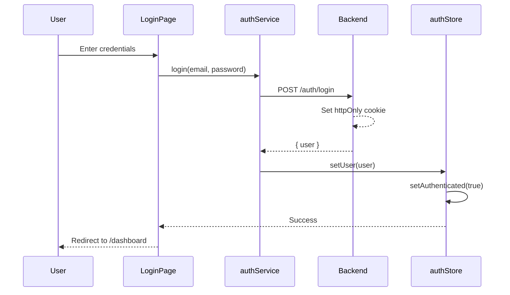
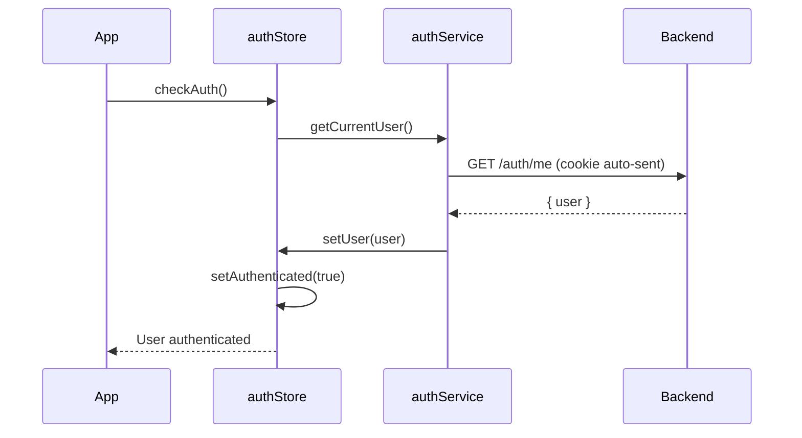
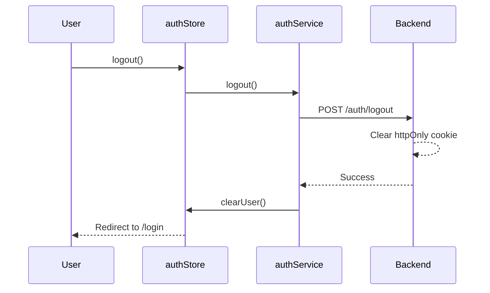

# Frontend Documentation

React-based web application for the MSM Car Booking system with httpOnly cookie authentication.

## Architecture

- **Framework:** React 19 with TypeScript
- **Build Tool:** Vite 6
- **Styling:** Tailwind CSS 4 + shadcn/ui (new-york style)
- **State Management:** Zustand (auth store)
- **Data Fetching:** Axios + TanStack Query v5
- **Forms:** React Hook Form + Zod v4
- **Routing:** React Router v7
- **Notifications:** Sonner (toast)
- **Icons:** Lucide React

## Documentation Index

### Design System

- **[Design System](./design-system.md)** - Glassmorphism theme, utility classes, and UI components

### Architecture

- **[Frontend Structure](#frontend-structure)** - Feature-based folder organization
- **[Authentication Flow](#authentication-flow)** - Cookie-based JWT authentication with Zustand
- **[Tech Stack Details](#tech-stack-details)** - Complete list of dependencies and their purposes

## Frontend Structure

The frontend follows a **feature-based architecture** for better scalability and maintainability:

```
frontend/src/
├── components/
│   ├── ui/              # shadcn/ui components (Button, Input, Card, etc.)
│   └── layout/          # Layout components
│       ├── AuthLayout.tsx       # Layout for login page
│       └── AppLayout.tsx        # Main app layout with sidebar
│
├── config/
│   ├── query-client.ts  # TanStack Query configuration
│   └── routes.tsx       # Route configuration with role-based access
│
├── constants/
│   ├── roles.ts         # Role definitions (as const objects)
│   └── statusStyles.ts  # Status badge color mappings
│
├── features/            # Feature modules (each is self-contained)
│   ├── auth/
│   │   ├── components/  # LoginForm.tsx
│   │   ├── hooks/       # useLogin.ts
│   │   ├── pages/       # LoginPage.tsx
│   │   ├── services/    # authService.ts (API calls)
│   │   ├── store/       # authStore.ts (Zustand)
│   │   └── types/       # auth.types.ts
│   │
│   ├── dashboard/
│   │   └── pages/       # DashboardPage.tsx
│   │
│   ├── users/
│   │   └── pages/       # UsersPage.tsx
│   │
│   └── bookings/
│       └── pages/       # BookingsPage.tsx
│
├── lib/
│   ├── axios.ts         # Axios instance with interceptors
│   ├── utils.ts         # cn() helper for Tailwind
│   ├── formatters.ts    # Date/currency formatters
│   └── uuid.ts          # UUID validation helpers
│
├── pages/
│   └── NotFoundPage.tsx # 404 page
│
├── types/
│   ├── enums.ts         # Enums as const objects (UserRole, etc.)
│   ├── user.types.ts    # User-related types
│   └── api.types.ts     # API response types
│
├── App.tsx              # Root component with QueryClientProvider
├── main.tsx             # Entry point
└── index.css            # Global styles + glassmorphism theme
```

### Why Feature-Based Architecture?

| Benefit | Description |
|---------|-------------|
| **Co-location** | All code for a feature lives together (types, services, components, hooks) |
| **Scalability** | Easy to add new features without affecting existing code |
| **Maintainability** | Clear boundaries make it easy to find and update code |
| **Reusability** | Shared code lives in `/components/ui`, `/lib`, `/types` |

## Authentication Flow

The frontend uses **httpOnly cookie-based JWT authentication** for security:

### Login Flow



**Key Points:**
- JWT token is **NOT** stored in frontend code or localStorage
- Token is automatically included in requests via httpOnly cookie
- Frontend only stores user data (no sensitive tokens)

### Session Validation Flow



**On App Initialization:**
1. `App.tsx` calls `authStore.checkAuth()` on mount
2. Backend validates JWT from httpOnly cookie
3. If valid, user data is loaded
4. If invalid, user is redirected to login

### Logout Flow



### Protected Routes

Routes are protected using `authStore` state:

```typescript
// src/config/routes.tsx
const ProtectedRoute = ({ children, allowedRoles }: ProtectedRouteProps) => {
  const { isAuthenticated, user, isLoading } = useAuthStore();

  if (isLoading) return <LoadingSpinner />;
  if (!isAuthenticated) return <Navigate to="/login" replace />;
  if (allowedRoles && !allowedRoles.includes(user!.role)) {
    return <Navigate to="/unauthorized" replace />;
  }

  return <>{children}</>;
};
```

**Role-Based Access:**
- `/dashboard` - All authenticated users
- `/users` - ADMIN only
- `/bookings` - ADMIN, PIC

## Tech Stack Details

### Core Dependencies

| Package | Version | Purpose |
|---------|---------|---------|
| `react` | 19.0.0 | UI library with automatic memoization |
| `react-dom` | 19.0.0 | DOM bindings |
| `typescript` | 5.9.0 | Type safety |
| `vite` | 6.0.7 | Build tool and dev server |

### Routing & State

| Package | Version | Purpose |
|---------|---------|---------|
| `react-router` | 7.1.3 | Routing library |
| `zustand` | 5.0.3 | Lightweight state management (auth store) |

### Data Fetching

| Package | Version | Purpose |
|---------|---------|---------|
| `axios` | 1.7.9 | HTTP client with interceptors |
| `@tanstack/react-query` | 5.62.14 | Server state management, caching, refetching |

### Forms & Validation

| Package | Version | Purpose |
|---------|---------|---------|
| `react-hook-form` | 7.54.2 | Performant form management |
| `zod` | 4.0.0-beta.3 | Schema validation |
| `@hookform/resolvers` | 3.10.0 | Zod resolver for React Hook Form |

### UI Components

| Package | Version | Purpose |
|---------|---------|---------|
| `@radix-ui/*` | Various | Unstyled, accessible UI primitives |
| `tailwindcss` | 4.0.0 | Utility-first CSS framework |
| `tailwindcss-animate` | 1.0.7 | Animation utilities |
| `tailwind-merge` | 3.0.1 | Merge Tailwind classes without conflicts |
| `clsx` | 2.1.1 | Conditional className utility |
| `class-variance-authority` | 0.7.1 | Type-safe component variants |
| `lucide-react` | 0.468.0 | Icon library |
| `sonner` | 1.7.3 | Toast notifications |

### Development Tools

| Package | Version | Purpose |
|---------|---------|---------|
| `@vitejs/plugin-react-swc` | 3.7.2 | Fast React refresh with SWC |
| `eslint` | 9.18.0 | Code linting |
| `prettier` | 3.4.2 | Code formatting |

## Path Aliases

TypeScript and Vite are configured with `@/` path alias:

```typescript
// Instead of:
import { Button } from '../../components/ui/button';

// Use:
import { Button } from '@/components/ui/button';
```

**Configuration:**
- `tsconfig.json` - TypeScript path mapping
- `vite.config.ts` - Vite resolver alias

## Environment Variables

Frontend environment variables are prefixed with `VITE_`:

```env
VITE_API_URL=http://localhost:3001/api/v1
```

**Access in code:**
```typescript
const API_URL = import.meta.env.VITE_API_URL;
```

## Development Workflow

```bash
# Install dependencies
pnpm install

# Start development server
pnpm dev

# Build for production
pnpm build

# Preview production build
pnpm preview

# Lint code
pnpm lint

# Format code
pnpm format
```

## Design Principles

### 1. React 19 Automatic Memoization

React 19 Compiler handles memoization automatically:

```typescript
// ❌ Don't use useCallback/useMemo (React 19 handles this)
const handleSubmit = useCallback(() => { ... }, [deps]);

// ✅ Just write normal functions
const handleSubmit = () => { ... };
```

### 2. Enum Usage

Use `as const` objects instead of TypeScript `enum` (due to TS 5.9 `erasableSyntaxOnly`):

```typescript
// ✅ Correct
export const UserRole = {
  ADMIN: 'ADMIN',
  PIC: 'PIC',
  EMPLOYEE: 'EMPLOYEE',
} as const;

export type UserRole = (typeof UserRole)[keyof typeof UserRole];

// ❌ Avoid
enum UserRole {
  ADMIN = 'ADMIN',
  PIC = 'PIC',
}
```

### 3. Form Handling

Use centralized form hooks for consistency:

```typescript
// src/hooks/forms/useFormSubmit.ts
import { useFormSubmit } from '@/hooks/forms/useFormSubmit';

const { handleSubmit, isSubmitting } = useFormSubmit({
  onSubmit: async (data) => {
    await createBooking(data);
  },
  successMessage: 'Booking created successfully',
  errorMessage: 'Failed to create booking',
});
```

### 4. Styling Conventions

Follow the design system guidelines:

```typescript
// Use existing glassmorphism utilities
<div className="glass-card p-4">
  {/* Content */}
</div>

// Use responsive Tailwind classes
<div className="grid grid-cols-1 sm:grid-cols-2 gap-4">
  {/* Form fields */}
</div>
```

## Security Considerations

### XSS Prevention

- All user input is automatically escaped by React
- httpOnly cookies prevent JavaScript access to JWT tokens
- No `dangerouslySetInnerHTML` usage

### CSRF Protection

- `sameSite: 'strict'` cookie attribute prevents CSRF
- CORS configured to allow only trusted origins

### Authentication State

```typescript
// Auth state is managed securely in Zustand store
interface AuthState {
  isAuthenticated: boolean;
  user: User | null;
  isLoading: boolean;
  checkAuth: () => Promise<void>;
  logout: () => Promise<void>;
}
```

## Related Documentation

- [Design System](./design-system.md)
- [Backend Security](../backend/security.md)
- [System Workflows](../system-workflows.md)
