# System Workflows

Visual diagrams showing how the MSM Car Booking system works based on requirements specification.

---

## System Overview

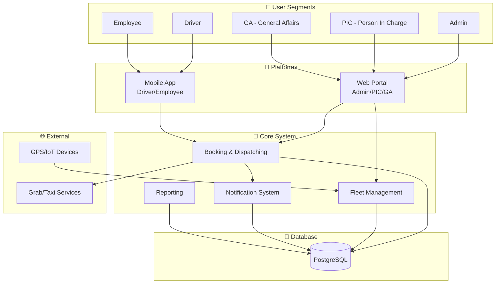
```mermaid
flowchart TB
    subgraph Users["👥 User Segments"]
        ADMIN[Admin]
        PIC[PIC - Person In Charge]
        GA[GA - General Affairs]
        DRIVER[Driver]
        EMP[Employee]
    end

    subgraph Platforms["📱 Platforms"]
        WEB[Web Portal<br/>Admin/PIC/GA]
        MOBILE[Mobile App<br/>Driver/Employee]
    end

    subgraph Core["🚗 Core System"]
        BOOKING[Booking & Dispatching]
        FLEET[Fleet Management]
        NOTIFY[Notification System]
        REPORT[Reporting]
    end

    subgraph Data["💾 Database"]
        DB[(PostgreSQL)]
    end

    subgraph External["🌐 External"]
        GPS[GPS/IoT Devices]
        GRAB[Grab/Taxi Services]
    end

    ADMIN --> WEB
    PIC --> WEB
    GA --> WEB
    DRIVER --> MOBILE
    EMP --> MOBILE

    WEB --> BOOKING
    WEB --> FLEET
    MOBILE --> BOOKING

    BOOKING --> DB
    FLEET --> DB
    NOTIFY --> DB
    REPORT --> DB

    GPS --> FLEET
    BOOKING --> GRAB
    BOOKING --> NOTIFY
```

### Database Tables Mapping

| System Module | Database Tables |
|--------------|-----------------|
| **Booking & Dispatching** | `bookings`, `trip_stops`, `booking_sequences`, `external_dispatches`, `pickup_points` |
| **Fleet Management** | `vehicles`, `km_quotas`, `gps_locations`, `odometer_logs`, `vehicle_maintenance` |
| **User Management** | `users`, `departments`, `driver_shifts` |
| **Notifications** | `notifications` |
| **Reporting & Config** | `trip_reports`, `audit_logs`, `system_configs` |
| **Driver App** | `trip_expenses`, `trip_events` |

**Total: 19 tables**

---

## 1. Booking & Dispatching Workflow

### 1.1 Complete Booking Lifecycle

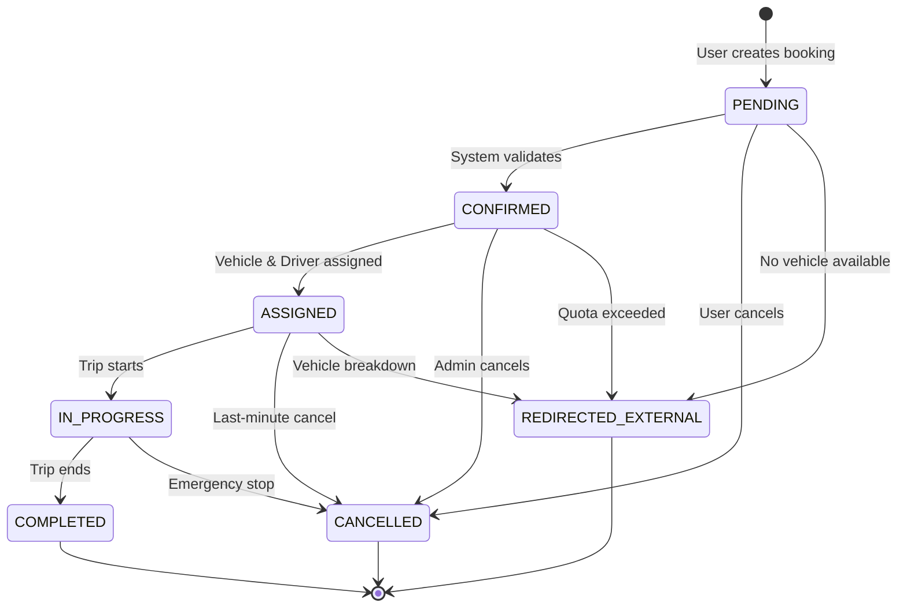
```mermaid
stateDiagram-v2
    [*] --> PENDING: User creates booking

    PENDING --> CONFIRMED: System validates
    PENDING --> CANCELLED: User cancels
    PENDING --> REDIRECTED_EXTERNAL: No vehicle available

    CONFIRMED --> ASSIGNED: Vehicle & Driver assigned
    CONFIRMED --> CANCELLED: Admin cancels
    CONFIRMED --> REDIRECTED_EXTERNAL: Quota exceeded

    ASSIGNED --> IN_PROGRESS: Trip starts
    ASSIGNED --> CANCELLED: Last-minute cancel
    ASSIGNED --> REDIRECTED_EXTERNAL: Vehicle breakdown

    IN_PROGRESS --> COMPLETED: Trip ends
    IN_PROGRESS --> CANCELLED: Emergency stop

    COMPLETED --> [*]
    CANCELLED --> [*]
    REDIRECTED_EXTERNAL --> [*]
```

### 1.2 Booking Creation Process

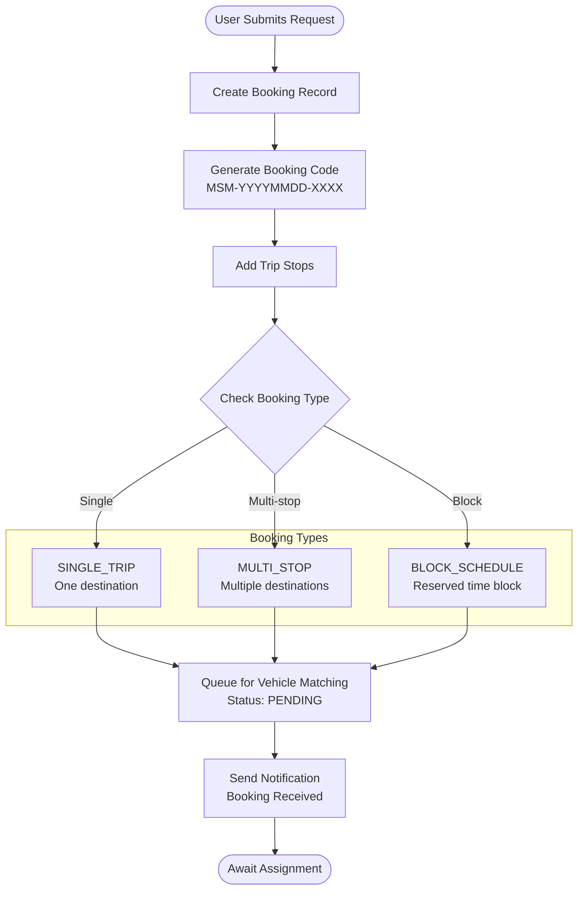
```mermaid
flowchart TD
    START([User Submits Request]) --> CREATE[Create Booking Record]
    CREATE --> CODE[Generate Booking Code<br/>MSM-YYYYMMDD-XXXX]
    CODE --> STOPS[Add Trip Stops]

    subgraph BookingTypes["Booking Types"]
        SINGLE[SINGLE_TRIP<br/>One destination]
        MULTI[MULTI_STOP<br/>Multiple destinations]
        BLOCK[BLOCK_SCHEDULE<br/>Reserved time block]
    end

    STOPS --> CHECK{Check Booking Type}
    CHECK -->|Single| SINGLE
    CHECK -->|Multi-stop| MULTI
    CHECK -->|Block| BLOCK

    SINGLE --> QUEUE
    MULTI --> QUEUE
    BLOCK --> QUEUE

    QUEUE[Queue for Vehicle Matching<br/>Status: PENDING] --> NOTIFY1[Send Notification<br/>Booking Received]

    NOTIFY1 --> END([Await Assignment])
```

**Database Flow:**
```
bookings (INSERT) → booking_sequences (UPDATE last_seq) → trip_stops (INSERT) → notifications (INSERT)
```

### 1.3 Multi-Stop Route Setup (Lộ trình đa điểm)

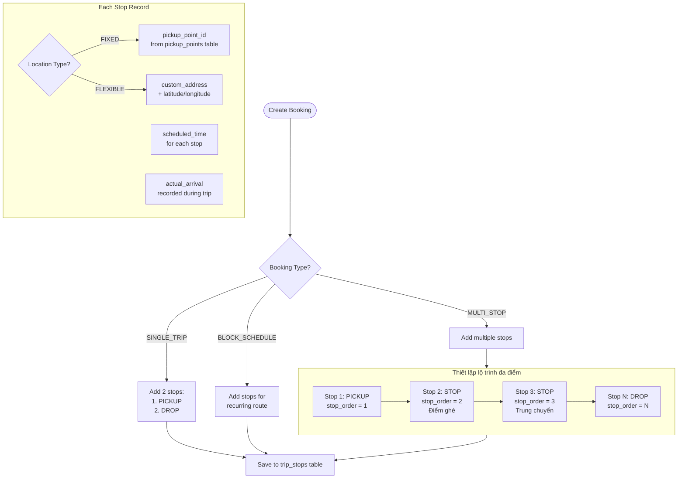
```mermaid
flowchart TD
    START([Create Booking]) --> TYPE{Booking Type?}

    TYPE -->|SINGLE_TRIP| SINGLE[Add 2 stops:<br/>1. PICKUP<br/>2. DROP]
    TYPE -->|MULTI_STOP| MULTI[Add multiple stops]
    TYPE -->|BLOCK_SCHEDULE| BLOCK[Add stops for<br/>recurring route]

    MULTI --> ADD_STOPS

    subgraph ADD_STOPS["Thiết lập lộ trình đa điểm"]
        S1[Stop 1: PICKUP<br/>stop_order = 1]
        S2[Stop 2: STOP<br/>stop_order = 2<br/>Điểm ghé]
        S3[Stop 3: STOP<br/>stop_order = 3<br/>Trung chuyển]
        S4[Stop N: DROP<br/>stop_order = N]

        S1 --> S2 --> S3 --> S4
    end

    subgraph StopDetails["Each Stop Record"]
        LOC{Location Type?}
        LOC -->|FIXED| FIXED[pickup_point_id<br/>from pickup_points table]
        LOC -->|FLEXIBLE| FLEX[custom_address<br/>+ latitude/longitude]

        TIME[scheduled_time<br/>for each stop]
        ACTUAL[actual_arrival<br/>recorded during trip]
    end

    ADD_STOPS --> SAVE[Save to trip_stops table]
    SINGLE --> SAVE
    BLOCK --> SAVE
```

**Stop Types (stop_type enum):**
| Type | Vietnamese | Description |
|------|------------|-------------|
| `PICKUP` | Điểm đón | First stop - pick up passengers |
| `STOP` | Điểm ghé / Trung chuyển | Intermediate stops |
| `DROP` | Điểm trả | Final destination |

**Database: `trip_stops` table**
```
booking_id     → Links to parent booking
pickup_point_id → FIXED location (from pickup_points)
custom_address  → FLEXIBLE location (user-defined)
stop_order     → Sequence: 1, 2, 3, ... N
stop_type      → PICKUP | STOP | DROP
scheduled_time → Expected arrival time
actual_arrival → Real arrival (updated during trip)
```

### 1.4 Automatic Vehicle Matching (Every 5 minutes)

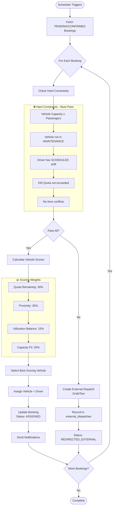
```mermaid
flowchart TD
    START([Scheduler Triggers]) --> FETCH[Fetch PENDING/CONFIRMED<br/>Bookings]

    FETCH --> LOOP{For Each Booking}

    LOOP --> HARD[Check Hard Constraints]

    subgraph HardConstraints["❌ Hard Constraints - Must Pass"]
        H1[Vehicle Capacity ≥ Passengers]
        H2[Vehicle not in MAINTENANCE]
        H3[Driver has SCHEDULED shift]
        H4[KM Quota not exceeded]
        H5[No time conflicts]
    end

    HARD --> H1 --> H2 --> H3 --> H4 --> H5

    H5 --> PASS{Pass All?}

    PASS -->|No| EXTERNAL[Create External Dispatch<br/>Grab/Taxi]
    PASS -->|Yes| SCORE[Calculate Vehicle Scores]

    subgraph SoftConstraints["📊 Scoring Weights"]
        S1[Quota Remaining: 30%]
        S2[Proximity: 35%]
        S3[Utilization Balance: 15%]
        S4[Capacity Fit: 20%]
    end

    SCORE --> S1
    S1 --> S2
    S2 --> S3
    S3 --> S4

    S4 --> BEST[Select Best Scoring Vehicle]
    BEST --> ASSIGN[Assign Vehicle + Driver]
    ASSIGN --> UPDATE[Update Booking<br/>Status: ASSIGNED]
    UPDATE --> NOTIFY[Send Notifications]

    EXTERNAL --> EXT_REC[Record in external_dispatches]
    EXT_REC --> EXT_STATUS[Status: REDIRECTED_EXTERNAL]

    NOTIFY --> NEXT{More Bookings?}
    EXT_STATUS --> NEXT
    NEXT -->|Yes| LOOP
    NEXT -->|No| END([Complete])
```

**Database Flow:**
```
bookings (SELECT pending) → vehicles (SELECT available) → km_quotas (CHECK)
→ driver_shifts (CHECK) → bookings (UPDATE assigned) → notifications (INSERT)
```

---

## 2. KM Quota Handling (Over-KM Logic)

### 2.1 Quota Decision Flowchart

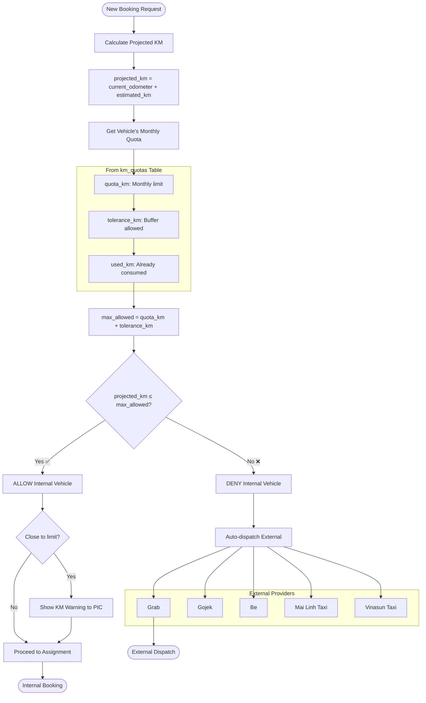
```mermaid
flowchart TD
    START([New Booking Request]) --> CALC[Calculate Projected KM]

    CALC --> FORMULA["projected_km = current_odometer + estimated_km"]

    FORMULA --> GET[Get Vehicle's Monthly Quota]

    subgraph QuotaData["From km_quotas Table"]
        Q1[quota_km: Monthly limit]
        Q2[tolerance_km: Buffer allowed]
        Q3[used_km: Already consumed]
    end

    GET --> Q1 --> Q2 --> Q3

    Q3 --> LIMIT["max_allowed = quota_km + tolerance_km"]

    LIMIT --> CHECK{projected_km ≤ max_allowed?}

    CHECK -->|Yes ✅| ALLOW[ALLOW Internal Vehicle]
    CHECK -->|No ❌| DENY[DENY Internal Vehicle]

    ALLOW --> WARN{Close to limit?}
    WARN -->|Yes| WARNING[Show KM Warning to PIC]
    WARN -->|No| ASSIGN[Proceed to Assignment]
    WARNING --> ASSIGN

    DENY --> AUTO[Auto-dispatch External]

    subgraph ExternalProviders["External Providers"]
        GRAB[Grab]
        GOJEK[Gojek]
        BE[Be]
        TAXI1[Mai Linh Taxi]
        TAXI2[Vinasun Taxi]
    end

    AUTO --> GRAB
    AUTO --> GOJEK
    AUTO --> BE
    AUTO --> TAXI1
    AUTO --> TAXI2

    ASSIGN --> SUCCESS([Internal Booking])
    GRAB --> EXTERNAL([External Dispatch])
```

### 2.2 Quota Update After Trip

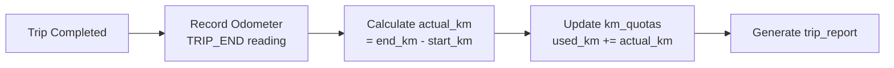
```mermaid
flowchart LR
    COMPLETE[Trip Completed] --> ODO[Record Odometer<br/>TRIP_END reading]
    ODO --> CALC[Calculate actual_km<br/>= end_km - start_km]
    CALC --> UPDATE[Update km_quotas<br/>used_km += actual_km]
    UPDATE --> REPORT[Generate trip_report]
```

**Database Trigger:**
```
bookings.status → COMPLETED triggers:
  1. odometer_logs (INSERT TRIP_END)
  2. km_quotas.used_km (UPDATE)
  3. trip_reports (INSERT)
```

---

## 3. Fleet Management Workflows

### 3.1 GPS Real-time Tracking

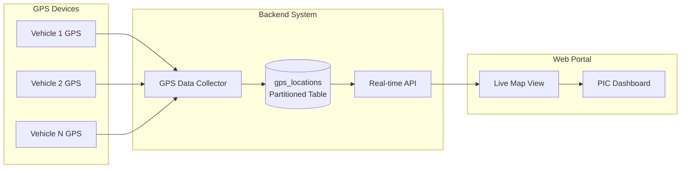
```mermaid
flowchart LR
    subgraph IoT["GPS Devices"]
        DEV1[Vehicle 1 GPS]
        DEV2[Vehicle 2 GPS]
        DEV3[Vehicle N GPS]
    end

    subgraph System["Backend System"]
        COLLECT[GPS Data Collector]
        STORE[(gps_locations<br/>Partitioned Table)]
        API[Real-time API]
    end

    subgraph UI["Web Portal"]
        MAP[Live Map View]
        PIC[PIC Dashboard]
    end

    DEV1 --> COLLECT
    DEV2 --> COLLECT
    DEV3 --> COLLECT

    COLLECT --> STORE
    STORE --> API
    API --> MAP
    MAP --> PIC
```

**Database:** `gps_locations` table (partitioned by month for performance)

### 3.2 Vehicle Status State Machine

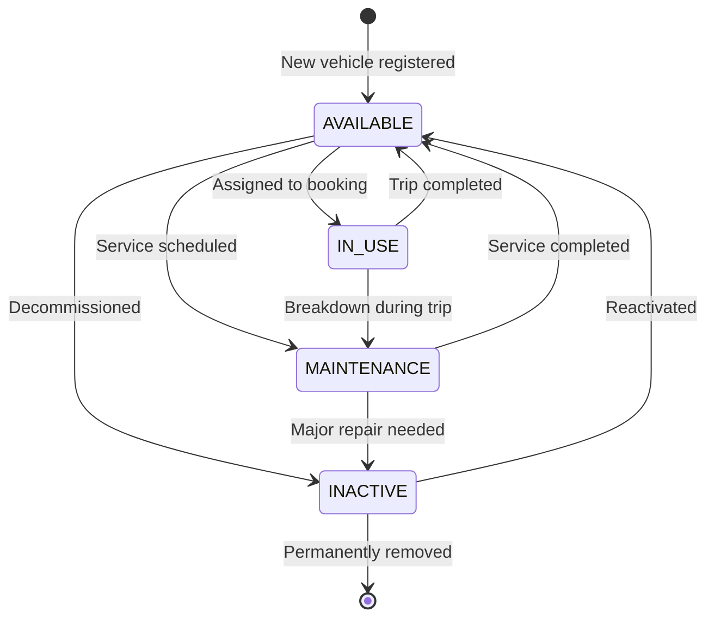
```mermaid
stateDiagram-v2
    [*] --> AVAILABLE: New vehicle registered

    AVAILABLE --> IN_USE: Assigned to booking
    AVAILABLE --> MAINTENANCE: Service scheduled
    AVAILABLE --> INACTIVE: Decommissioned

    IN_USE --> AVAILABLE: Trip completed
    IN_USE --> MAINTENANCE: Breakdown during trip

    MAINTENANCE --> AVAILABLE: Service completed
    MAINTENANCE --> INACTIVE: Major repair needed

    INACTIVE --> AVAILABLE: Reactivated
    INACTIVE --> [*]: Permanently removed
```

### 3.3 Driver Shift Management

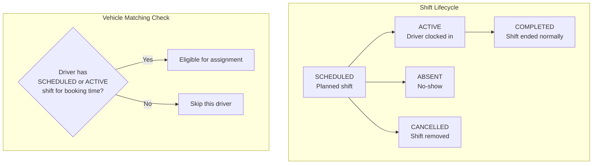
```mermaid
flowchart TD
    subgraph Morning["Shift Lifecycle"]
        SCHED[SCHEDULED<br/>Planned shift] --> ACTIVE[ACTIVE<br/>Driver clocked in]
        ACTIVE --> COMP[COMPLETED<br/>Shift ended normally]
        SCHED --> ABSENT[ABSENT<br/>No-show]
        SCHED --> CANCEL[CANCELLED<br/>Shift removed]
    end

    subgraph Matching["Vehicle Matching Check"]
        CHECK{Driver has<br/>SCHEDULED or ACTIVE<br/>shift for booking time?}
        CHECK -->|Yes| ELIGIBLE[Eligible for assignment]
        CHECK -->|No| SKIP[Skip this driver]
    end
```

**Database:** `driver_shifts` table with unique constraint on (driver_id, shift_date, start_time)

---

## 4. Notification System

### 4.1 Notification Flow

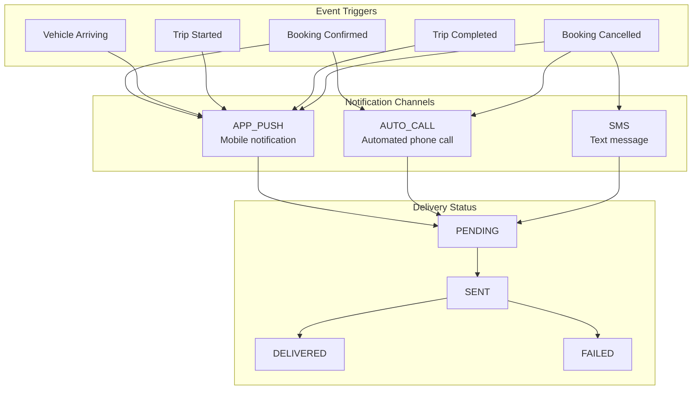
```mermaid
flowchart TD
    subgraph Triggers["Event Triggers"]
        T1[Booking Confirmed]
        T2[Vehicle Arriving]
        T3[Trip Started]
        T4[Trip Completed]
        T5[Booking Cancelled]
    end

    subgraph Channels["Notification Channels"]
        APP[APP_PUSH<br/>Mobile notification]
        CALL[AUTO_CALL<br/>Automated phone call]
        SMS[SMS<br/>Text message]
    end

    subgraph Status["Delivery Status"]
        PENDING[PENDING] --> SENT[SENT]
        SENT --> DELIVERED[DELIVERED]
        SENT --> FAILED[FAILED]
    end

    T1 --> APP
    T1 --> CALL
    T2 --> APP
    T3 --> APP
    T4 --> APP
    T5 --> APP
    T5 --> CALL
    T5 --> SMS

    APP --> PENDING
    CALL --> PENDING
    SMS --> PENDING
```

**Database:** `notifications` table linked to `users` and `bookings`

---

## 5. User Segments & Access

### 5.1 User Role Permissions

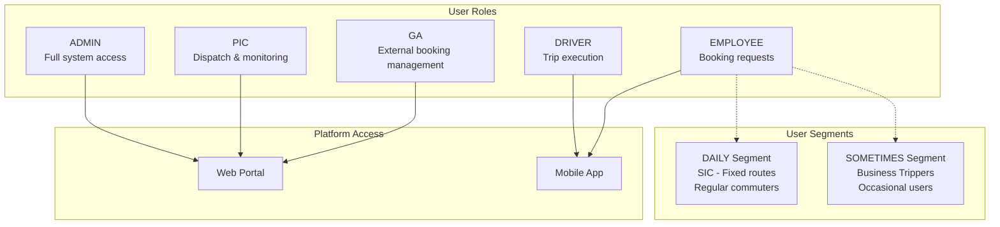
```mermaid
flowchart TB
    subgraph Roles["User Roles"]
        ADMIN["ADMIN<br/>Full system access"]
        PIC["PIC<br/>Dispatch & monitoring"]
        GA["GA<br/>External booking management"]
        DRIVER["DRIVER<br/>Trip execution"]
        EMPLOYEE["EMPLOYEE<br/>Booking requests"]
    end

    subgraph Segments["User Segments"]
        DAILY["DAILY Segment<br/>SIC - Fixed routes<br/>Regular commuters"]
        SOMETIMES["SOMETIMES Segment<br/>Business Trippers<br/>Occasional users"]
    end

    subgraph Access["Platform Access"]
        WEB["Web Portal"]
        MOBILE["Mobile App"]
    end

    ADMIN --> WEB
    PIC --> WEB
    GA --> WEB
    DRIVER --> MOBILE
    EMPLOYEE --> MOBILE

    EMPLOYEE -.-> DAILY
    EMPLOYEE -.-> SOMETIMES
```

### 5.2 Booking Flow by User Type

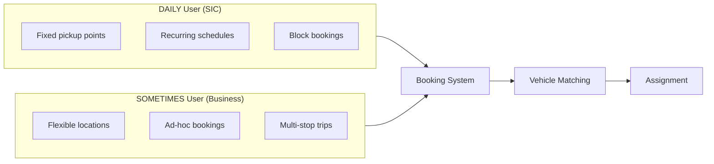
```mermaid
flowchart LR
    subgraph DailyUser["DAILY User (SIC)"]
        D1[Fixed pickup points]
        D2[Recurring schedules]
        D3[Block bookings]
    end

    subgraph SometimesUser["SOMETIMES User (Business)"]
        S1[Flexible locations]
        S2[Ad-hoc bookings]
        S3[Multi-stop trips]
    end

    DailyUser --> BOOK[Booking System]
    SometimesUser --> BOOK

    BOOK --> MATCH[Vehicle Matching]
    MATCH --> ASSIGN[Assignment]
```

---

## 6. Reporting & Audit

### 6.1 Data Flow to Reports

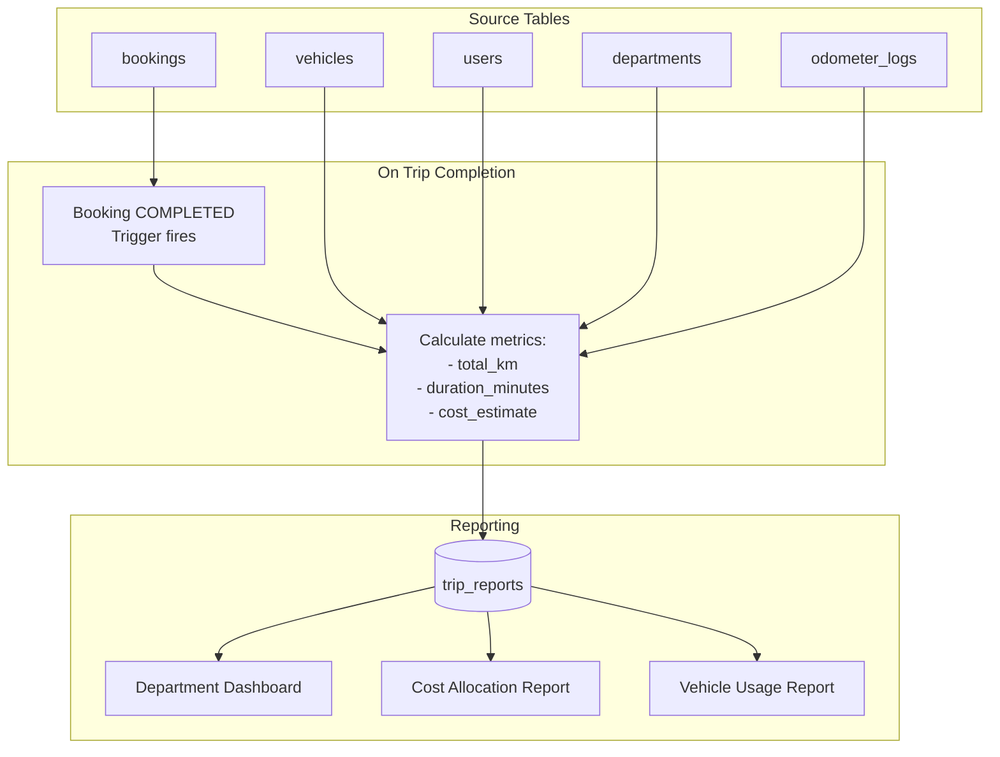
```mermaid
flowchart TD
    subgraph Sources["Source Tables"]
        B[bookings]
        V[vehicles]
        U[users]
        D[departments]
        O[odometer_logs]
    end

    subgraph Processing["On Trip Completion"]
        TRIGGER[Booking COMPLETED<br/>Trigger fires]
        CALC[Calculate metrics:<br/>- total_km<br/>- duration_minutes<br/>- cost_estimate]
    end

    subgraph Output["Reporting"]
        TR[(trip_reports)]
        DASH[Department Dashboard]
        COST[Cost Allocation Report]
        USAGE[Vehicle Usage Report]
    end

    B --> TRIGGER
    TRIGGER --> CALC
    V --> CALC
    U --> CALC
    D --> CALC
    O --> CALC

    CALC --> TR
    TR --> DASH
    TR --> COST
    TR --> USAGE
```

### 6.2 Audit Trail

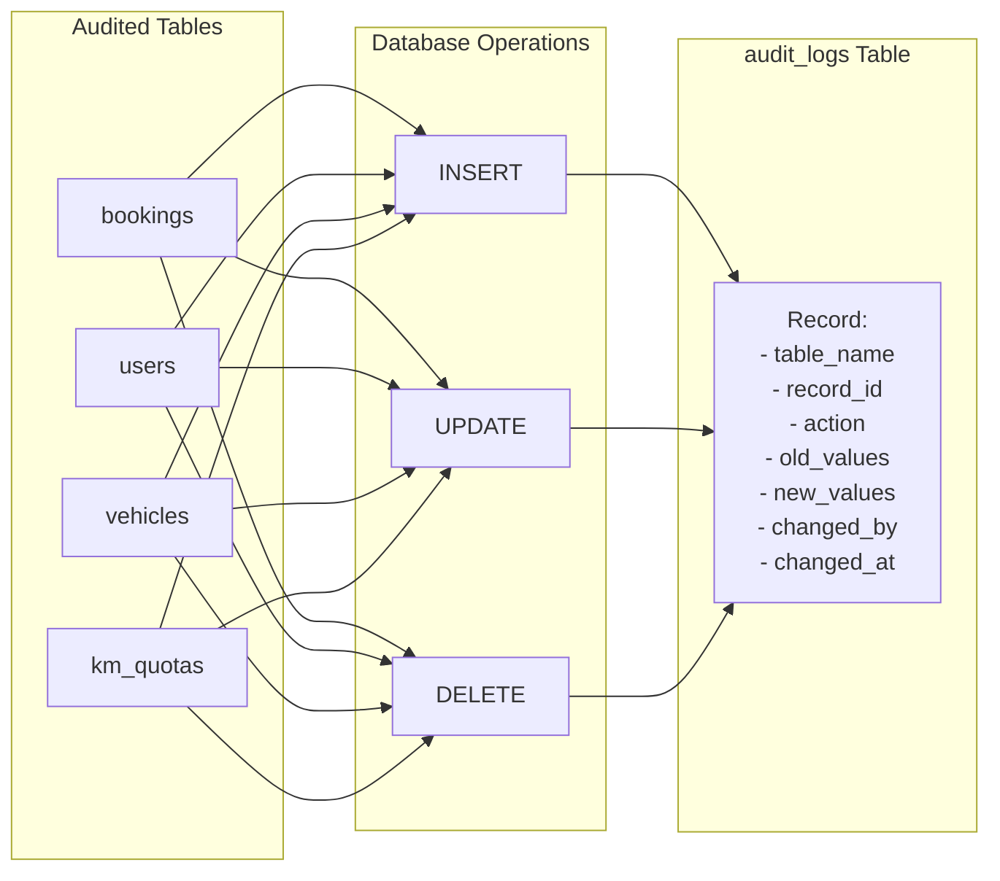
```mermaid
flowchart LR
    subgraph Actions["Database Operations"]
        INS[INSERT]
        UPD[UPDATE]
        DEL[DELETE]
    end

    subgraph Tables["Audited Tables"]
        T1[bookings]
        T2[users]
        T3[vehicles]
        T4[km_quotas]
    end

    subgraph Audit["audit_logs Table"]
        LOG[Record:<br/>- table_name<br/>- record_id<br/>- action<br/>- old_values<br/>- new_values<br/>- changed_by<br/>- changed_at]
    end

    T1 --> INS & UPD & DEL
    T2 --> INS & UPD & DEL
    T3 --> INS & UPD & DEL
    T4 --> INS & UPD & DEL

    INS --> LOG
    UPD --> LOG
    DEL --> LOG
```

---

## 7. External Dispatch Integration

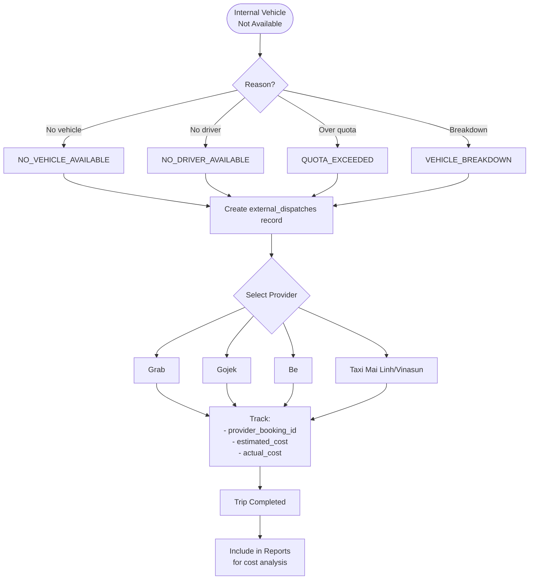
```mermaid
flowchart TD
    START([Internal Vehicle<br/>Not Available]) --> REASON{Reason?}

    REASON -->|No vehicle| R1[NO_VEHICLE_AVAILABLE]
    REASON -->|No driver| R2[NO_DRIVER_AVAILABLE]
    REASON -->|Over quota| R3[QUOTA_EXCEEDED]
    REASON -->|Breakdown| R4[VEHICLE_BREAKDOWN]

    R1 --> CREATE
    R2 --> CREATE
    R3 --> CREATE
    R4 --> CREATE

    CREATE[Create external_dispatches record]

    CREATE --> SELECT{Select Provider}

    SELECT --> GRAB[Grab]
    SELECT --> GOJEK[Gojek]
    SELECT --> BE[Be]
    SELECT --> TAXI[Taxi Mai Linh/Vinasun]

    GRAB --> TRACK
    GOJEK --> TRACK
    BE --> TRACK
    TAXI --> TRACK

    TRACK[Track:<br/>- provider_booking_id<br/>- estimated_cost<br/>- actual_cost]

    TRACK --> COMPLETE[Trip Completed]
    COMPLETE --> REPORT[Include in Reports<br/>for cost analysis]
```

**Database:** `external_dispatches` linked to `bookings` with status `REDIRECTED_EXTERNAL`

---

## 8. Authentication & SSO

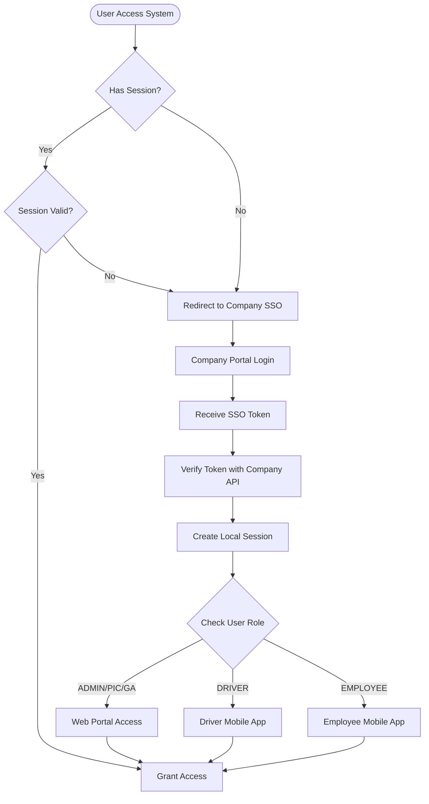
```mermaid
flowchart TD
    START([User Access System]) --> CHECK{Has Session?}

    CHECK -->|Yes| VALID{Session Valid?}
    CHECK -->|No| SSO[Redirect to Company SSO]

    VALID -->|Yes| ACCESS[Grant Access]
    VALID -->|No| SSO

    SSO --> LOGIN[Company Portal Login]
    LOGIN --> TOKEN[Receive SSO Token]
    TOKEN --> VERIFY[Verify Token with Company API]
    VERIFY --> CREATE[Create Local Session]
    CREATE --> ROLE{Check User Role}

    ROLE -->|ADMIN/PIC/GA| WEB[Web Portal Access]
    ROLE -->|DRIVER| MOBILE_D[Driver Mobile App]
    ROLE -->|EMPLOYEE| MOBILE_E[Employee Mobile App]

    WEB --> ACCESS
    MOBILE_D --> ACCESS
    MOBILE_E --> ACCESS
```

**Database:** `users` table stores role, linked to company SSO via email

---

## 9. System Configuration (Cấu hình tham số)

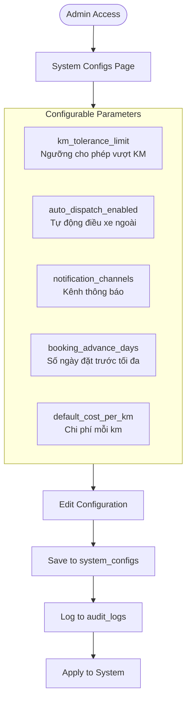
```mermaid
flowchart TD
    ADMIN([Admin Access]) --> CONFIG[System Configs Page]

    CONFIG --> PARAMS

    subgraph PARAMS["Configurable Parameters"]
        P1[km_tolerance_limit<br/>Ngưỡng cho phép vượt KM]
        P2[auto_dispatch_enabled<br/>Tự động điều xe ngoài]
        P3[notification_channels<br/>Kênh thông báo]
        P4[booking_advance_days<br/>Số ngày đặt trước tối đa]
        P5[default_cost_per_km<br/>Chi phí mỗi km]
    end

    PARAMS --> EDIT[Edit Configuration]
    EDIT --> SAVE[Save to system_configs]
    SAVE --> AUDIT[Log to audit_logs]
    AUDIT --> APPLY[Apply to System]
```

**Database:** `system_configs` table with JSONB values
```json
{
  "km_tolerance_limit": 50,
  "auto_dispatch_enabled": true,
  "notification_channels": ["APP_PUSH", "AUTO_CALL"],
  "booking_advance_days": 30,
  "default_cost_per_km": 5000
}
```

---

## 10. Vehicle Management (Quản lý hồ sơ đội xe)

### 10.1 Vehicle CRUD Operations

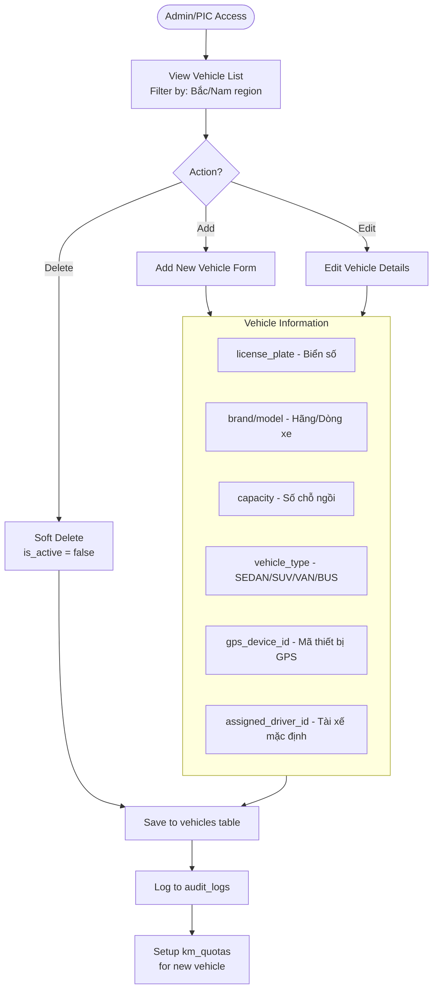
```mermaid
flowchart TD
    START([Admin/PIC Access]) --> LIST[View Vehicle List<br/>Filter by: Bắc/Nam region]

    LIST --> ACTION{Action?}

    ACTION -->|Add| ADD[Add New Vehicle Form]
    ACTION -->|Edit| EDIT[Edit Vehicle Details]
    ACTION -->|Delete| DEL[Soft Delete<br/>is_active = false]

    ADD --> FORM
    EDIT --> FORM

    subgraph FORM["Vehicle Information"]
        F1[license_plate - Biển số]
        F2[brand/model - Hãng/Dòng xe]
        F3[capacity - Số chỗ ngồi]
        F4[vehicle_type - SEDAN/SUV/VAN/BUS]
        F5[gps_device_id - Mã thiết bị GPS]
        F6[assigned_driver_id - Tài xế mặc định]
    end

    FORM --> SAVE[Save to vehicles table]
    DEL --> SAVE
    SAVE --> AUDIT[Log to audit_logs]
    AUDIT --> QUOTA[Setup km_quotas<br/>for new vehicle]
```

### 10.2 Vehicle Calendar/Timeline (Lịch của từng xe)

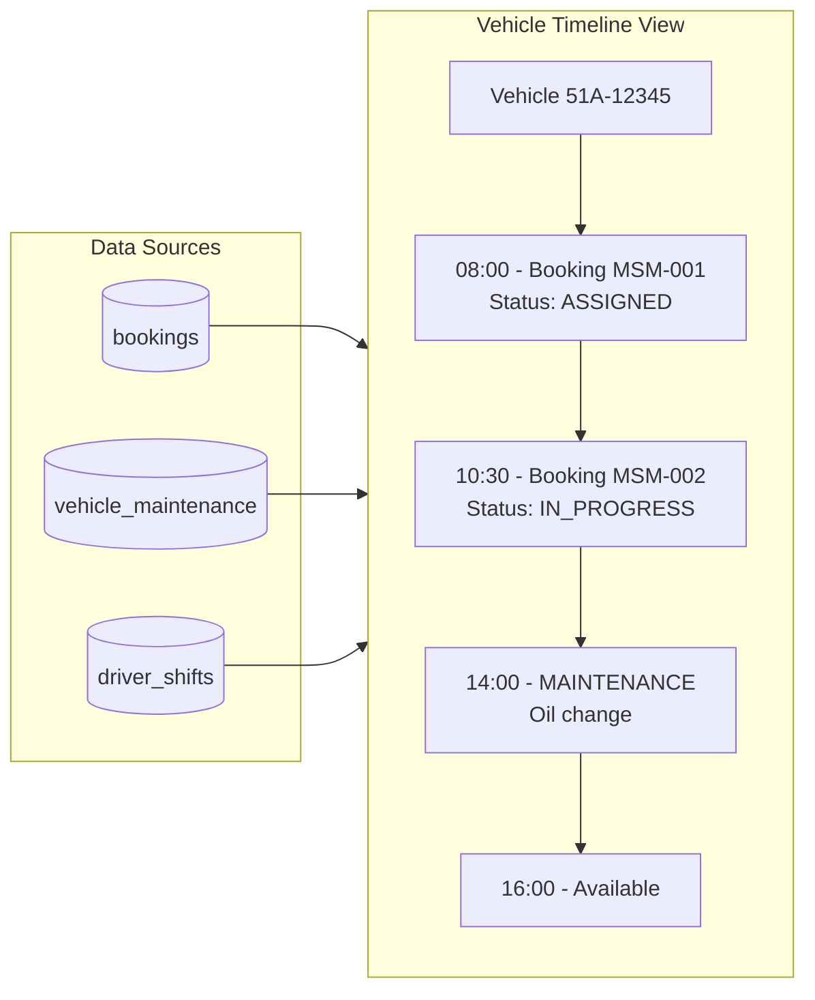
```mermaid
flowchart LR
    subgraph Calendar["Vehicle Timeline View"]
        direction TB
        V1["Vehicle 51A-12345"]
        T1[08:00 - Booking MSM-001<br/>Status: ASSIGNED]
        T2[10:30 - Booking MSM-002<br/>Status: IN_PROGRESS]
        T3[14:00 - MAINTENANCE<br/>Oil change]
        T4[16:00 - Available]

        V1 --> T1 --> T2 --> T3 --> T4
    end

    subgraph Data["Data Sources"]
        B[(bookings)]
        M[(vehicle_maintenance)]
        S[(driver_shifts)]
    end

    B --> Calendar
    M --> Calendar
    S --> Calendar
```

**Query:** Join `bookings` + `vehicle_maintenance` + `driver_shifts` by date/time

---

## 11. GPS History Playback (Xem lại lộ trình)

```mermaid
flowchart TD
    START([PIC Selects Vehicle]) --> RANGE[Select Date/Time Range]

    RANGE --> QUERY[Query gps_locations<br/>WHERE vehicle_id AND recorded_at BETWEEN]

    QUERY --> DATA[(GPS Data Points)]

    DATA --> PROCESS[Process Route Data]

    subgraph PLAYBACK["Playback Features"]
        MAP[Display on Map]
        SPEED[Show Speed at Each Point]
        STOPS[Highlight Stop Points]
        TIMELINE[Playback Timeline Control]
    end

    PROCESS --> MAP
    PROCESS --> SPEED
    PROCESS --> STOPS
    PROCESS --> TIMELINE

    subgraph Controls["Playback Controls"]
        PLAY[Play/Pause]
        SEEK[Seek to Time]
        RATE[Playback Speed 1x/2x/4x]
    end

    TIMELINE --> PLAY
    TIMELINE --> SEEK
    TIMELINE --> RATE
```

**Database:** `gps_locations` partitioned by month for efficient historical queries

---

## 12. Booking Cancellation (Huỷ đặt xe)

```mermaid
flowchart TD
    START([Cancel Request]) --> WHO{Who Cancels?}

    WHO -->|User| USER[User cancels own booking]
    WHO -->|Admin/PIC| ADMIN[Admin cancels any booking]

    USER --> REASON
    ADMIN --> REASON

    subgraph REASON["Select Cancellation Reason"]
        R1[USER_REQUEST - Người dùng hủy]
        R2[NO_VEHICLE_AVAILABLE - Hết xe]
        R3[NO_DRIVER_AVAILABLE - Hết tài xế]
        R4[QUOTA_EXCEEDED - Vượt hạn mức]
        R5[VEHICLE_BREAKDOWN - Xe hỏng]
        R6[SCHEDULE_CONFLICT - Trùng lịch]
        R7[WEATHER - Thời tiết xấu]
        R8[EMERGENCY - Khẩn cấp]
        R9[DUPLICATE - Trùng lặp]
        R10[OTHER - Lý do khác]
    end

    REASON --> UPDATE[Update Booking]

    subgraph UPDATE_FIELDS["Update Fields"]
        U1[status = CANCELLED]
        U2[cancelled_at = NOW]
        U3[cancelled_by = user_id]
        U4[cancellation_reason = selected]
    end

    UPDATE --> RELEASE[Release Vehicle & Driver]
    RELEASE --> NOTIFY[Send Notifications]

    subgraph NOTIFY_TO["Notify To"]
        N1[Requester - Booking cancelled]
        N2[Driver - Trip cancelled]
        N3[PIC - For monitoring]
    end

    NOTIFY --> AUDIT[Log to audit_logs]
```

---

## 13. Auto-Call System (Hệ thống gọi tự động)

### 13.1 Telephony Integration (Cổng kết nối tổng đài)

```mermaid
flowchart LR
    subgraph System["MSM Car Booking"]
        TRIGGER[Event Trigger]
        QUEUE[Call Queue]
        API[Telephony API Client]
    end

    subgraph Provider["Telephony Provider"]
        VOIP[VoIP Gateway]
        TTS[Text-to-Speech Engine]
        CALL[Outbound Call]
    end

    subgraph User["End User"]
        PHONE[User's Phone]
    end

    TRIGGER --> QUEUE
    QUEUE --> API
    API --> VOIP
    VOIP --> TTS
    TTS --> CALL
    CALL --> PHONE
```

### 13.2 Auto-Call Scenarios (Kịch bản gọi tự động)

```mermaid
flowchart TD
    subgraph Scenarios["Auto-Call Triggers"]
        S1[BOOKING_CONFIRMED<br/>Xác nhận đặt xe]
        S2[VEHICLE_ARRIVING<br/>Xe sắp đến]
        S3[BOOKING_CANCELLED<br/>Hủy chuyến]
    end

    S1 --> BUILD1["Build Message:<br/>Đặt xe thành công.<br/>Xe BIỂN_SỐ sẽ đón bạn<br/>lúc GIỜ ngày NGÀY"]

    S2 --> BUILD2["Build Message:<br/>Xe BIỂN_SỐ của tài xế TÊN<br/>sẽ đến trong 5 phút"]

    S3 --> BUILD3["Build Message:<br/>Chuyến xe của bạn đã bị hủy.<br/>Lý do: LÝ_DO"]

    BUILD1 --> TTS
    BUILD2 --> TTS
    BUILD3 --> TTS

    subgraph TTS["Text-to-Speech Processing"]
        CONVERT[Convert Text to Speech<br/>Vietnamese voice]
        AUDIO[Generate Audio File]
    end

    TTS --> CONVERT --> AUDIO

    AUDIO --> DIAL[Dial User Phone]
    DIAL --> PLAY[Play Audio Message]
    PLAY --> LOG[Log Call Result<br/>to notifications table]

    subgraph CallStatus["Call Status"]
        CS1[SENT - Call initiated]
        CS2[DELIVERED - User answered]
        CS3[FAILED - No answer/busy]
    end

    LOG --> CS1
    LOG --> CS2
    LOG --> CS3
```

### 13.3 Text-to-Speech Variables

| Variable | Source | Example |
|----------|--------|---------|
| `BIỂN_SỐ` | `vehicles.license_plate` | 51A-12345 |
| `TÊN` | `users.full_name` (driver) | Nguyễn Văn A |
| `GIỜ` | `bookings.scheduled_time` | 08:30 |
| `NGÀY` | `bookings.scheduled_date` | 15/02/2026 |
| `LÝ_DO` | `bookings.cancellation_reason` | Người dùng hủy |

**Database:** `notifications` with `channel = AUTO_CALL`

---

## Database-Requirements Verification (All 28 Requirements)

| STT | Requirement | Workflow Section | Database Support | Status |
|-----|-------------|------------------|------------------|--------|
| 1 | Khảo sát & Thiết kế tích hợp | N/A (Project phase) | - | ➖ |
| 2 | SSO | Section 8 | `users` linked to company SSO | ✅ |
| 3 | Quản lý người dùng | Section 5.1 | `users`, `departments` | ✅ |
| 4 | Phân quyền | Section 5.1 | `users.role` enum | ✅ |
| 5 | Cấu hình tham số | Section 9 | `system_configs` JSONB | ✅ |
| 6 | Báo cáo tổng hợp chi phí | Section 6.1 | `trip_reports`, `external_dispatches` | ✅ |
| 7 | Báo cáo tổng số km | Section 6.1 | `trip_reports.total_km`, `km_quotas` | ✅ |
| 8 | Báo cáo lịch sử chuyến đi | Section 6.1 | `trip_reports`, `bookings` | ✅ |
| 9 | Danh sách xe | Section 10.1 | `vehicles` with filters | ✅ |
| 10 | Thêm/sửa/xóa xe | Section 10.1 | `vehicles` CRUD + `audit_logs` | ✅ |
| 11 | Thiết lập định mức | Section 2 | `km_quotas` table | ✅ |
| 12 | Trạng thái xe | Section 3.2 | `vehicles.status` enum | ✅ |
| 13 | Xem vị trí hiện tại | Section 3.1 | `gps_locations` real-time | ✅ |
| 14 | Xem lại lộ trình | Section 11 | `gps_locations` partitioned | ✅ |
| 15 | Quản lý điểm đón | Section 1.3 | `pickup_points` FIXED/FLEXIBLE | ✅ |
| 16 | Lịch của từng xe | Section 10.2 | `bookings` + `vehicle_maintenance` | ✅ |
| 17 | Thuật toán matching xe | Section 1.4 | Weighted scoring algorithm | ✅ |
| 18 | Cảnh báo vượt hạn mức | Section 2.1 | `km_quotas` + warning logic | ✅ |
| 19 | Form đặt xe | Section 1.2 | `bookings` table | ✅ |
| 20 | Thêm điểm dừng | Section 1.3 | `trip_stops` with `stop_order` | ✅ |
| 21 | Block lịch | Section 1.2 | `booking_type = BLOCK_SCHEDULE` | ✅ |
| 22 | Huỷ đặt xe | Section 12 | `bookings` cancellation fields | ✅ |
| 23 | Hàng chờ thuê ngoài | Section 7 | `external_dispatches` queue | ✅ |
| 24 | Ghi nhận thông tin | Section 7 | `external_dispatches` details | ✅ |
| 25 | Cập nhật trạng thái | Section 7 | `notifications` to user | ✅ |
| 26 | Cổng kết nối tổng đài | Section 13.1 | `notifications.channel = AUTO_CALL` | ✅ |
| 27 | Kịch bản gọi tự động | Section 13.2 | `notification_type` triggers | ✅ |
| 28 | Text-to-Speech | Section 13.3 | Dynamic message variables | ✅ |

### Summary

- **Total Requirements:** 28
- **Covered:** 27 ✅
- **Not Applicable:** 1 ➖ (Project analysis phase)
- **Coverage:** 100%

---

## Driver App - Requirements Verification (13 Features)

| No. | Feature | Database Support | Status |
|-----|---------|------------------|--------|
| 1 | Login | `users` table with role=DRIVER | ✅ |
| 2 | Trip List | `bookings` filtered by assigned_driver_id | ✅ |
| 3 | Trip Order Details | `bookings` + `trip_stops` + `users` (requester) | ✅ |
| 4 | Confirm Task | `bookings.driver_response` + `trip_events` | ✅ |
| 5 | Start/End Trip | `bookings.status` + `trip_events` | ✅ |
| 6 | Record Expenses | `trip_expenses` table | ✅ |
| 7 | Enter Start/End Odometer | `odometer_logs` table | ✅ |
| 8 | Validity Check | `odometer_logs` + `gps_locations` comparison | ✅ |
| 9 | Push Notification | `notifications` with channel=APP_PUSH | ✅ |
| 10 | Schedule Reminder | `notifications` with scheduled delivery | ✅ |
| 11 | Trigger Auto-call | `notifications` with channel=AUTO_CALL + `trip_events` | ✅ |
| 12 | Trip History | `bookings` + `trip_reports` | ✅ |
| 13 | KM Summary | `v_driver_monthly_stats` view | ✅ |

**Driver App Coverage: 13/13 (100%)**

---

## Employee App - Requirements Verification (8 Features)

| No. | Feature | Database Support | Status |
|-----|---------|------------------|--------|
| 1 | Login | `users` table with role=EMPLOYEE | ✅ |
| 2 | Basic Booking | `bookings` with booking_type=SINGLE_TRIP | ✅ |
| 3 | Multi-stop Booking | `bookings` + `trip_stops` with multiple entries | ✅ |
| 4 | Block Booking by Day | `bookings` with booking_type=BLOCK_SCHEDULE, end_date | ✅ |
| 5 | Cancel Booking | `bookings` cancellation fields | ✅ |
| 6 | Booking History List | `bookings` filtered by requester_id | ✅ |
| 7 | Instant Confirmation | `notifications` BOOKING_CONFIRMED or external redirect | ✅ |
| 8 | Push Notification | `notifications` with channel=APP_PUSH | ✅ |

**Employee App Coverage: 8/8 (100%)**

---

## Overall System Coverage Summary

| Platform | Features | Covered | Coverage |
|----------|----------|---------|----------|
| Web Portal | 28 | 27 | 96% |
| Driver App | 13 | 13 | 100% |
| Employee App | 8 | 8 | 100% |
| **Total** | **49** | **48** | **98%** |

*Note: 1 Web Portal feature (Survey & Integration Design) is a project phase, not a system feature.*
