# Luồng hệ thống

Sơ đồ trực quan minh họa cách hệ thống MSM Car Booking hoạt động dựa trên đặc tả yêu cầu.

---

## Tổng quan hệ thống

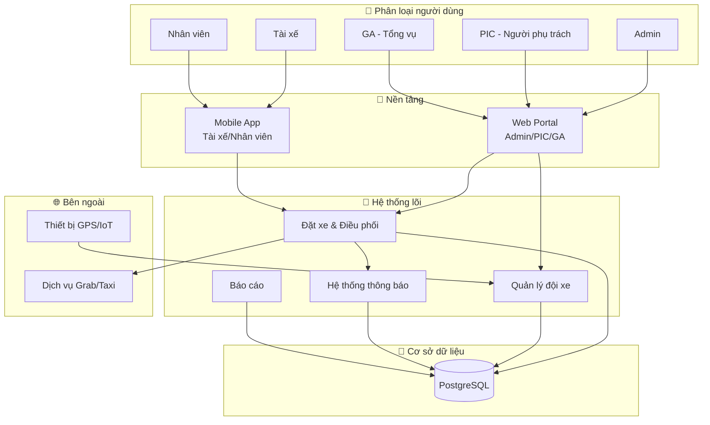
```mermaid
flowchart TB
    subgraph Users["👥 Phân loại người dùng"]
        ADMIN[Admin]
        PIC[PIC - Người phụ trách]
        GA[GA - Tổng vụ]
        DRIVER[Tài xế]
        EMP[Nhân viên]
    end

    subgraph Platforms["📱 Nền tảng"]
        WEB[Web Portal<br/>Admin/PIC/GA]
        MOBILE[Mobile App<br/>Tài xế/Nhân viên]
    end

    subgraph Core["🚗 Hệ thống lõi"]
        BOOKING[Đặt xe & Điều phối]
        FLEET[Quản lý đội xe]
        NOTIFY[Hệ thống thông báo]
        REPORT[Báo cáo]
    end

    subgraph Data["💾 Cơ sở dữ liệu"]
        DB[(PostgreSQL)]
    end

    subgraph External["🌐 Bên ngoài"]
        GPS[Thiết bị GPS/IoT]
        GRAB[Dịch vụ Grab/Taxi]
    end

    ADMIN --> WEB
    PIC --> WEB
    GA --> WEB
    DRIVER --> MOBILE
    EMP --> MOBILE

    WEB --> BOOKING
    WEB --> FLEET
    MOBILE --> BOOKING

    BOOKING --> DB
    FLEET --> DB
    NOTIFY --> DB
    REPORT --> DB

    GPS --> FLEET
    BOOKING --> GRAB
    BOOKING --> NOTIFY
```

### Ánh xạ bảng cơ sở dữ liệu

| Module hệ thống | Bảng cơ sở dữ liệu |
|----------------|-------------------|
| **Đặt xe & Điều phối** | `bookings`, `trip_stops`, `booking_sequences`, `external_dispatches`, `pickup_points` |
| **Quản lý đội xe** | `vehicles`, `km_quotas`, `gps_locations`, `odometer_logs`, `vehicle_maintenance` |
| **Quản lý người dùng** | `users`, `departments`, `driver_shifts` |
| **Thông báo** | `notifications` |
| **Báo cáo & Cấu hình** | `trip_reports`, `audit_logs`, `system_configs` |

**Tổng cộng: 17 bảng**

---

## 1. Quy trình Đặt xe & Điều phối

### 1.1 Vòng đời đặt xe hoàn chỉnh

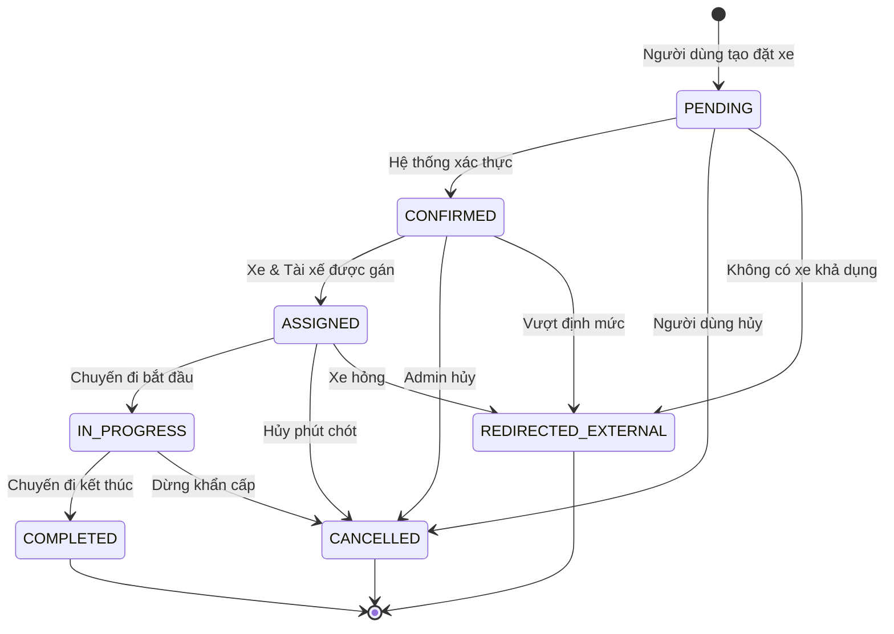
```mermaid
stateDiagram-v2
    [*] --> PENDING: Người dùng tạo đặt xe

    PENDING --> CONFIRMED: Hệ thống xác thực
    PENDING --> CANCELLED: Người dùng hủy
    PENDING --> REDIRECTED_EXTERNAL: Không có xe khả dụng

    CONFIRMED --> ASSIGNED: Xe & Tài xế được gán
    CONFIRMED --> CANCELLED: Admin hủy
    CONFIRMED --> REDIRECTED_EXTERNAL: Vượt định mức

    ASSIGNED --> IN_PROGRESS: Chuyến đi bắt đầu
    ASSIGNED --> CANCELLED: Hủy phút chót
    ASSIGNED --> REDIRECTED_EXTERNAL: Xe hỏng

    IN_PROGRESS --> COMPLETED: Chuyến đi kết thúc
    IN_PROGRESS --> CANCELLED: Dừng khẩn cấp

    COMPLETED --> [*]
    CANCELLED --> [*]
    REDIRECTED_EXTERNAL --> [*]
```

### 1.2 Quy trình tạo đặt xe

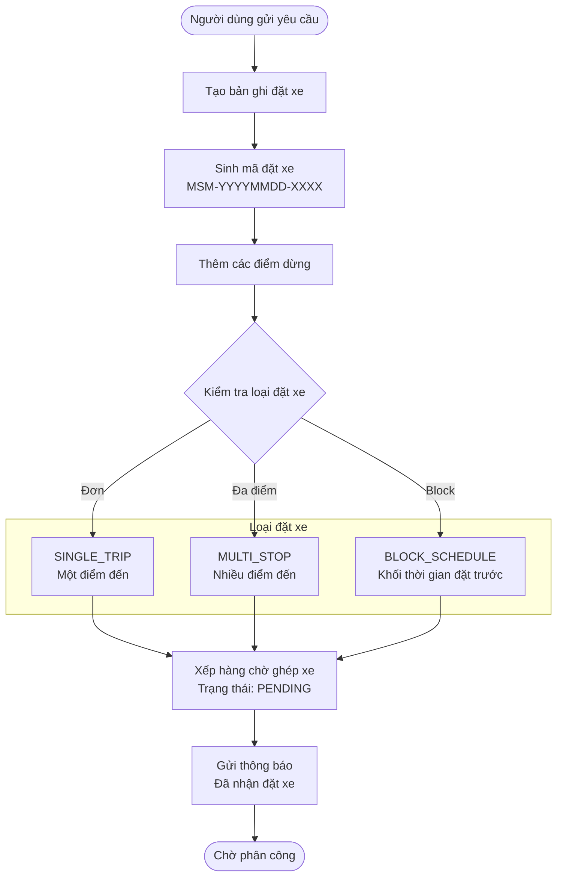
```mermaid
flowchart TD
    START([Người dùng gửi yêu cầu]) --> CREATE[Tạo bản ghi đặt xe]
    CREATE --> CODE[Sinh mã đặt xe<br/>MSM-YYYYMMDD-XXXX]
    CODE --> STOPS[Thêm các điểm dừng]

    subgraph BookingTypes["Loại đặt xe"]
        SINGLE[SINGLE_TRIP<br/>Một điểm đến]
        MULTI[MULTI_STOP<br/>Nhiều điểm đến]
        BLOCK[BLOCK_SCHEDULE<br/>Khối thời gian đặt trước]
    end

    STOPS --> CHECK{Kiểm tra loại đặt xe}
    CHECK -->|Đơn| SINGLE
    CHECK -->|Đa điểm| MULTI
    CHECK -->|Block| BLOCK

    SINGLE --> QUEUE
    MULTI --> QUEUE
    BLOCK --> QUEUE

    QUEUE[Xếp hàng chờ ghép xe<br/>Trạng thái: PENDING] --> NOTIFY1[Gửi thông báo<br/>Đã nhận đặt xe]

    NOTIFY1 --> END([Chờ phân công])
```

**Luồng cơ sở dữ liệu:**
```
bookings (INSERT) → booking_sequences (UPDATE last_seq) → trip_stops (INSERT) → notifications (INSERT)
```

### 1.3 Thiết lập lộ trình đa điểm

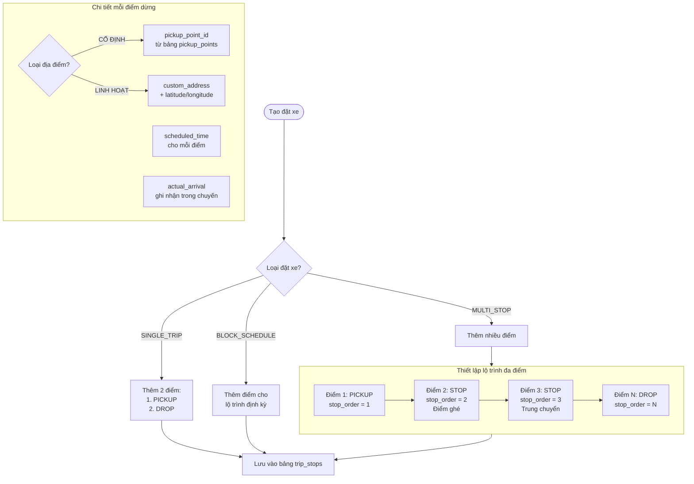
```mermaid
flowchart TD
    START([Tạo đặt xe]) --> TYPE{Loại đặt xe?}

    TYPE -->|SINGLE_TRIP| SINGLE[Thêm 2 điểm:<br/>1. PICKUP<br/>2. DROP]
    TYPE -->|MULTI_STOP| MULTI[Thêm nhiều điểm]
    TYPE -->|BLOCK_SCHEDULE| BLOCK[Thêm điểm cho<br/>lộ trình định kỳ]

    MULTI --> ADD_STOPS

    subgraph ADD_STOPS["Thiết lập lộ trình đa điểm"]
        S1[Điểm 1: PICKUP<br/>stop_order = 1]
        S2[Điểm 2: STOP<br/>stop_order = 2<br/>Điểm ghé]
        S3[Điểm 3: STOP<br/>stop_order = 3<br/>Trung chuyển]
        S4[Điểm N: DROP<br/>stop_order = N]

        S1 --> S2 --> S3 --> S4
    end

    subgraph StopDetails["Chi tiết mỗi điểm dừng"]
        LOC{Loại địa điểm?}
        LOC -->|CỐ ĐỊNH| FIXED[pickup_point_id<br/>từ bảng pickup_points]
        LOC -->|LINH HOẠT| FLEX[custom_address<br/>+ latitude/longitude]

        TIME[scheduled_time<br/>cho mỗi điểm]
        ACTUAL[actual_arrival<br/>ghi nhận trong chuyến]
    end

    ADD_STOPS --> SAVE[Lưu vào bảng trip_stops]
    SINGLE --> SAVE
    BLOCK --> SAVE
```

**Loại điểm dừng (stop_type enum):**
| Loại | Tiếng Việt | Mô tả |
|------|------------|-------|
| `PICKUP` | Điểm đón | Điểm đầu - đón hành khách |
| `STOP` | Điểm ghé / Trung chuyển | Các điểm trung gian |
| `DROP` | Điểm trả | Điểm đến cuối cùng |

**Cơ sở dữ liệu: bảng `trip_stops`**
```
booking_id     → Liên kết tới đặt xe cha
pickup_point_id → Địa điểm CỐ ĐỊNH (từ pickup_points)
custom_address  → Địa điểm LINH HOẠT (người dùng định nghĩa)
stop_order     → Thứ tự: 1, 2, 3, ... N
stop_type      → PICKUP | STOP | DROP
scheduled_time → Thời gian dự kiến
actual_arrival → Thời gian thực (cập nhật trong chuyến)
```

### 1.4 Ghép xe tự động (Mỗi 5 phút)

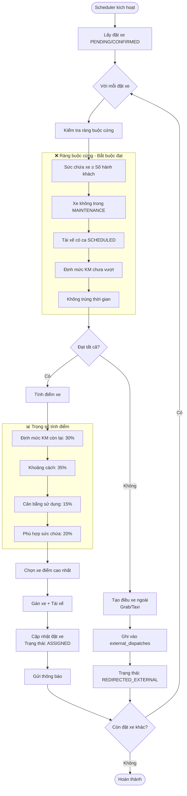
```mermaid
flowchart TD
    START([Scheduler kích hoạt]) --> FETCH[Lấy đặt xe PENDING/CONFIRMED]

    FETCH --> LOOP{Với mỗi đặt xe}

    LOOP --> HARD[Kiểm tra ràng buộc cứng]

    subgraph HardConstraints["❌ Ràng buộc cứng - Bắt buộc đạt"]
        H1[Sức chứa xe ≥ Số hành khách]
        H2[Xe không trong MAINTENANCE]
        H3[Tài xế có ca SCHEDULED]
        H4[Định mức KM chưa vượt]
        H5[Không trùng thời gian]
    end

    HARD --> H1 --> H2 --> H3 --> H4 --> H5

    H5 --> PASS{Đạt tất cả?}

    PASS -->|Không| EXTERNAL[Tạo điều xe ngoài<br/>Grab/Taxi]
    PASS -->|Có| SCORE[Tính điểm xe]

    subgraph SoftConstraints["📊 Trọng số tính điểm"]
        S1[Định mức KM còn lại: 30%]
        S2[Khoảng cách: 35%]
        S3[Cân bằng sử dụng: 15%]
        S4[Phù hợp sức chứa: 20%]
    end

    SCORE --> S1
    S1 --> S2
    S2 --> S3
    S3 --> S4

    S4 --> BEST[Chọn xe điểm cao nhất]
    BEST --> ASSIGN[Gán xe + Tài xế]
    ASSIGN --> UPDATE[Cập nhật đặt xe<br/>Trạng thái: ASSIGNED]
    UPDATE --> NOTIFY[Gửi thông báo]

    EXTERNAL --> EXT_REC[Ghi vào external_dispatches]
    EXT_REC --> EXT_STATUS[Trạng thái: REDIRECTED_EXTERNAL]

    NOTIFY --> NEXT{Còn đặt xe khác?}
    EXT_STATUS --> NEXT
    NEXT -->|Có| LOOP
    NEXT -->|Không| END([Hoàn thành])
```

**Luồng cơ sở dữ liệu:**
```
bookings (SELECT pending) → vehicles (SELECT available) → km_quotas (CHECK)
→ driver_shifts (CHECK) → bookings (UPDATE assigned) → notifications (INSERT)
```

---

## 2. Xử lý định mức KM (Logic vượt KM)

### 2.1 Sơ đồ quyết định định mức

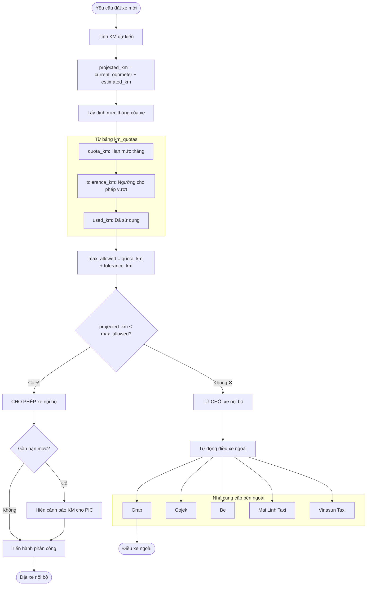
```mermaid
flowchart TD
    START([Yêu cầu đặt xe mới]) --> CALC[Tính KM dự kiến]

    CALC --> FORMULA["projected_km = current_odometer + estimated_km"]

    FORMULA --> GET[Lấy định mức tháng của xe]

    subgraph QuotaData["Từ bảng km_quotas"]
        Q1[quota_km: Hạn mức tháng]
        Q2[tolerance_km: Ngưỡng cho phép vượt]
        Q3[used_km: Đã sử dụng]
    end

    GET --> Q1 --> Q2 --> Q3

    Q3 --> LIMIT["max_allowed = quota_km + tolerance_km"]

    LIMIT --> CHECK{projected_km ≤ max_allowed?}

    CHECK -->|Có ✅| ALLOW[CHO PHÉP xe nội bộ]
    CHECK -->|Không ❌| DENY[TỪ CHỐI xe nội bộ]

    ALLOW --> WARN{Gần hạn mức?}
    WARN -->|Có| WARNING[Hiện cảnh báo KM cho PIC]
    WARN -->|Không| ASSIGN[Tiến hành phân công]
    WARNING --> ASSIGN

    DENY --> AUTO[Tự động điều xe ngoài]

    subgraph ExternalProviders["Nhà cung cấp bên ngoài"]
        GRAB[Grab]
        GOJEK[Gojek]
        BE[Be]
        TAXI1[Mai Linh Taxi]
        TAXI2[Vinasun Taxi]
    end

    AUTO --> GRAB
    AUTO --> GOJEK
    AUTO --> BE
    AUTO --> TAXI1
    AUTO --> TAXI2

    ASSIGN --> SUCCESS([Đặt xe nội bộ])
    GRAB --> EXTERNAL([Điều xe ngoài])
```

### 2.2 Cập nhật định mức sau chuyến đi

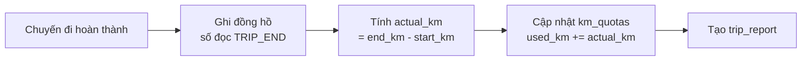
```mermaid
flowchart LR
    COMPLETE[Chuyến đi hoàn thành] --> ODO[Ghi đồng hồ<br/>số đọc TRIP_END]
    ODO --> CALC[Tính actual_km<br/>= end_km - start_km]
    CALC --> UPDATE[Cập nhật km_quotas<br/>used_km += actual_km]
    UPDATE --> REPORT[Tạo trip_report]
```

**Trigger cơ sở dữ liệu:**
```
bookings.status → COMPLETED kích hoạt:
  1. odometer_logs (INSERT TRIP_END)
  2. km_quotas.used_km (UPDATE)
  3. trip_reports (INSERT)
```

---

## 3. Quy trình quản lý đội xe

### 3.1 Theo dõi GPS thời gian thực

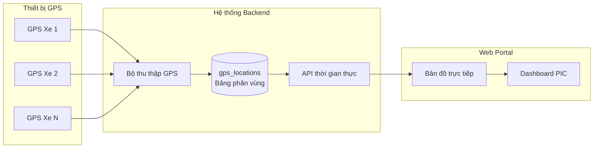
```mermaid
flowchart LR
    subgraph IoT["Thiết bị GPS"]
        DEV1[GPS Xe 1]
        DEV2[GPS Xe 2]
        DEV3[GPS Xe N]
    end

    subgraph System["Hệ thống Backend"]
        COLLECT[Bộ thu thập GPS]
        STORE[(gps_locations<br/>Bảng phân vùng)]
        API[API thời gian thực]
    end

    subgraph UI["Web Portal"]
        MAP[Bản đồ trực tiếp]
        PIC[Dashboard PIC]
    end

    DEV1 --> COLLECT
    DEV2 --> COLLECT
    DEV3 --> COLLECT

    COLLECT --> STORE
    STORE --> API
    API --> MAP
    MAP --> PIC
```

**Cơ sở dữ liệu:** bảng `gps_locations` (phân vùng theo tháng để tối ưu hiệu năng)

### 3.2 Máy trạng thái xe

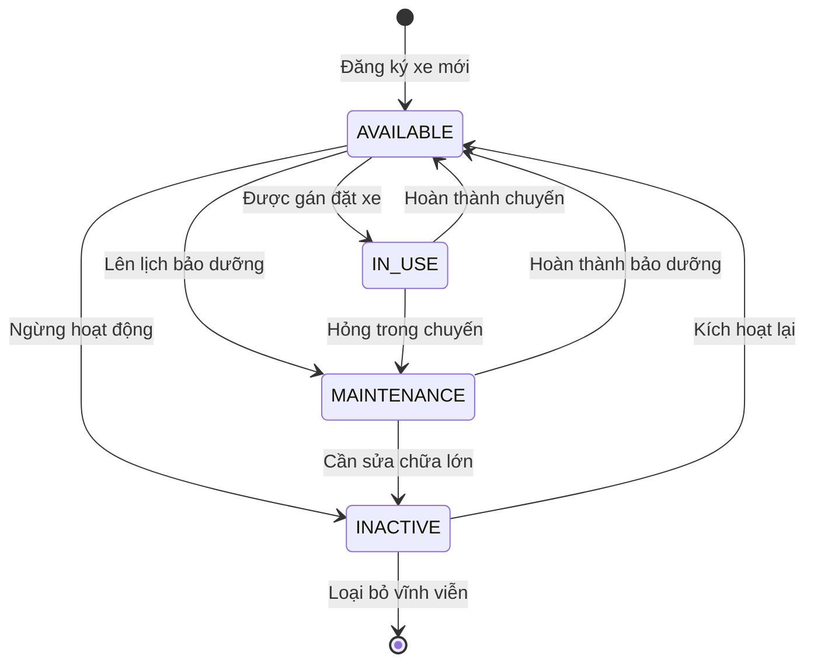
```mermaid
stateDiagram-v2
    [*] --> AVAILABLE: Đăng ký xe mới

    AVAILABLE --> IN_USE: Được gán đặt xe
    AVAILABLE --> MAINTENANCE: Lên lịch bảo dưỡng
    AVAILABLE --> INACTIVE: Ngừng hoạt động

    IN_USE --> AVAILABLE: Hoàn thành chuyến
    IN_USE --> MAINTENANCE: Hỏng trong chuyến

    MAINTENANCE --> AVAILABLE: Hoàn thành bảo dưỡng
    MAINTENANCE --> INACTIVE: Cần sửa chữa lớn

    INACTIVE --> AVAILABLE: Kích hoạt lại
    INACTIVE --> [*]: Loại bỏ vĩnh viễn
```

### 3.3 Quản lý ca làm việc tài xế

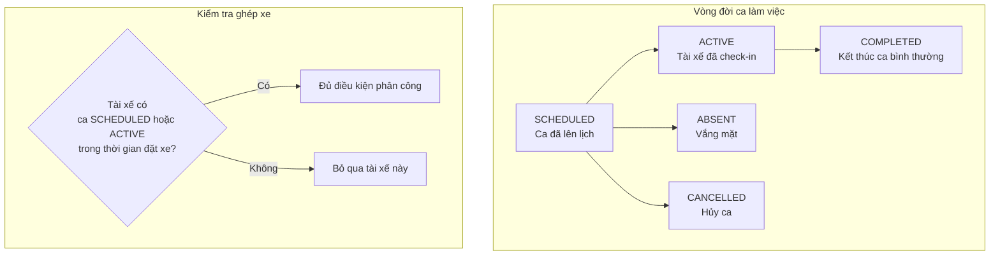
```mermaid
flowchart TD
    subgraph Morning["Vòng đời ca làm việc"]
        SCHED[SCHEDULED<br/>Ca đã lên lịch] --> ACTIVE[ACTIVE<br/>Tài xế đã check-in]
        ACTIVE --> COMP[COMPLETED<br/>Kết thúc ca bình thường]
        SCHED --> ABSENT[ABSENT<br/>Vắng mặt]
        SCHED --> CANCEL[CANCELLED<br/>Hủy ca]
    end

    subgraph Matching["Kiểm tra ghép xe"]
        CHECK{Tài xế có<br/>ca SCHEDULED hoặc ACTIVE<br/>trong thời gian đặt xe?}
        CHECK -->|Có| ELIGIBLE[Đủ điều kiện phân công]
        CHECK -->|Không| SKIP[Bỏ qua tài xế này]
    end
```

**Cơ sở dữ liệu:** bảng `driver_shifts` với ràng buộc unique trên (driver_id, shift_date, start_time)

---

## 4. Hệ thống thông báo

### 4.1 Luồng thông báo

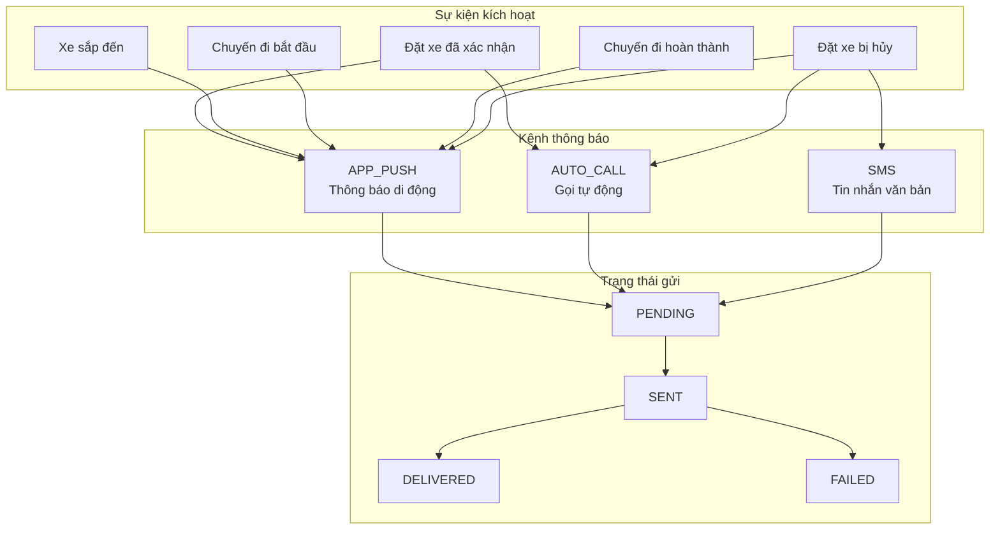
```mermaid
flowchart TD
    subgraph Triggers["Sự kiện kích hoạt"]
        T1[Đặt xe đã xác nhận]
        T2[Xe sắp đến]
        T3[Chuyến đi bắt đầu]
        T4[Chuyến đi hoàn thành]
        T5[Đặt xe bị hủy]
    end

    subgraph Channels["Kênh thông báo"]
        APP[APP_PUSH<br/>Thông báo di động]
        CALL[AUTO_CALL<br/>Gọi tự động]
        SMS[SMS<br/>Tin nhắn văn bản]
    end

    subgraph Status["Trạng thái gửi"]
        PENDING[PENDING] --> SENT[SENT]
        SENT --> DELIVERED[DELIVERED]
        SENT --> FAILED[FAILED]
    end

    T1 --> APP
    T1 --> CALL
    T2 --> APP
    T3 --> APP
    T4 --> APP
    T5 --> APP
    T5 --> CALL
    T5 --> SMS

    APP --> PENDING
    CALL --> PENDING
    SMS --> PENDING
```

**Cơ sở dữ liệu:** bảng `notifications` liên kết với `users` và `bookings`

---

## 5. Phân loại người dùng & Quyền truy cập

### 5.1 Quyền theo vai trò

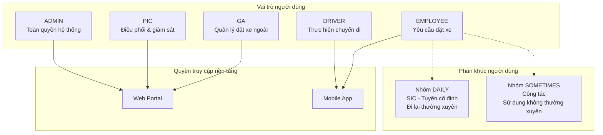
```mermaid
flowchart TB
    subgraph Roles["Vai trò người dùng"]
        ADMIN["ADMIN<br/>Toàn quyền hệ thống"]
        PIC["PIC<br/>Điều phối & giám sát"]
        GA["GA<br/>Quản lý đặt xe ngoài"]
        DRIVER["DRIVER<br/>Thực hiện chuyến đi"]
        EMPLOYEE["EMPLOYEE<br/>Yêu cầu đặt xe"]
    end

    subgraph Segments["Phân khúc người dùng"]
        DAILY["Nhóm DAILY<br/>SIC - Tuyến cố định<br/>Đi lại thường xuyên"]
        SOMETIMES["Nhóm SOMETIMES<br/>Công tác<br/>Sử dụng không thường xuyên"]
    end

    subgraph Access["Quyền truy cập nền tảng"]
        WEB["Web Portal"]
        MOBILE["Mobile App"]
    end

    ADMIN --> WEB
    PIC --> WEB
    GA --> WEB
    DRIVER --> MOBILE
    EMPLOYEE --> MOBILE

    EMPLOYEE -.-> DAILY
    EMPLOYEE -.-> SOMETIMES
```

### 5.2 Luồng đặt xe theo loại người dùng

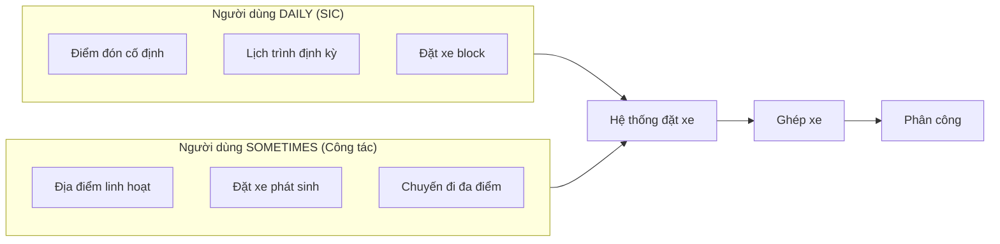
```mermaid
flowchart LR
    subgraph DailyUser["Người dùng DAILY (SIC)"]
        D1[Điểm đón cố định]
        D2[Lịch trình định kỳ]
        D3[Đặt xe block]
    end

    subgraph SometimesUser["Người dùng SOMETIMES (Công tác)"]
        S1[Địa điểm linh hoạt]
        S2[Đặt xe phát sinh]
        S3[Chuyến đi đa điểm]
    end

    DailyUser --> BOOK[Hệ thống đặt xe]
    SometimesUser --> BOOK

    BOOK --> MATCH[Ghép xe]
    MATCH --> ASSIGN[Phân công]
```

---

## 6. Báo cáo & Kiểm toán

### 6.1 Luồng dữ liệu đến báo cáo

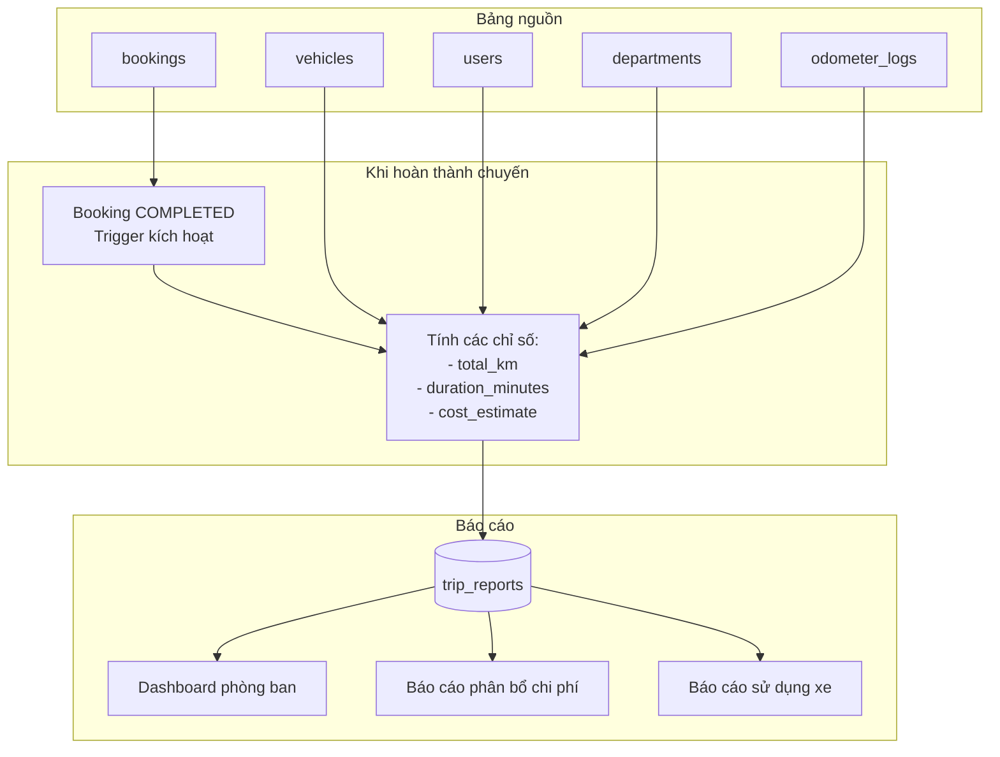
```mermaid
flowchart TD
    subgraph Sources["Bảng nguồn"]
        B[bookings]
        V[vehicles]
        U[users]
        D[departments]
        O[odometer_logs]
    end

    subgraph Processing["Khi hoàn thành chuyến"]
        TRIGGER[Booking COMPLETED<br/>Trigger kích hoạt]
        CALC[Tính các chỉ số:<br/>- total_km<br/>- duration_minutes<br/>- cost_estimate]
    end

    subgraph Output["Báo cáo"]
        TR[(trip_reports)]
        DASH[Dashboard phòng ban]
        COST[Báo cáo phân bổ chi phí]
        USAGE[Báo cáo sử dụng xe]
    end

    B --> TRIGGER
    TRIGGER --> CALC
    V --> CALC
    U --> CALC
    D --> CALC
    O --> CALC

    CALC --> TR
    TR --> DASH
    TR --> COST
    TR --> USAGE
```

### 6.2 Nhật ký kiểm toán

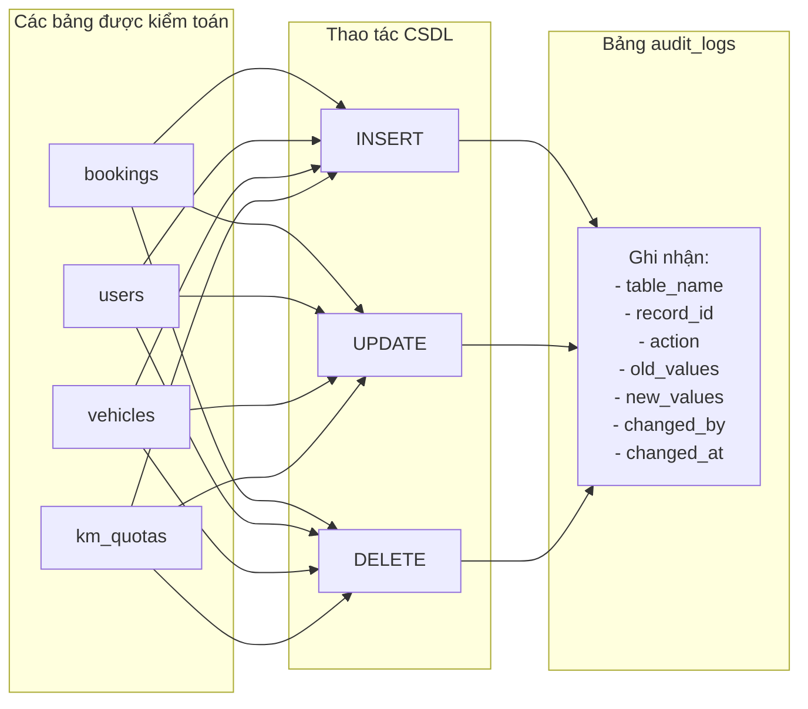
```mermaid
flowchart LR
    subgraph Actions["Thao tác CSDL"]
        INS[INSERT]
        UPD[UPDATE]
        DEL[DELETE]
    end

    subgraph Tables["Các bảng được kiểm toán"]
        T1[bookings]
        T2[users]
        T3[vehicles]
        T4[km_quotas]
    end

    subgraph Audit["Bảng audit_logs"]
        LOG[Ghi nhận:<br/>- table_name<br/>- record_id<br/>- action<br/>- old_values<br/>- new_values<br/>- changed_by<br/>- changed_at]
    end

    T1 --> INS & UPD & DEL
    T2 --> INS & UPD & DEL
    T3 --> INS & UPD & DEL
    T4 --> INS & UPD & DEL

    INS --> LOG
    UPD --> LOG
    DEL --> LOG
```

---

## 7. Tích hợp điều xe ngoài

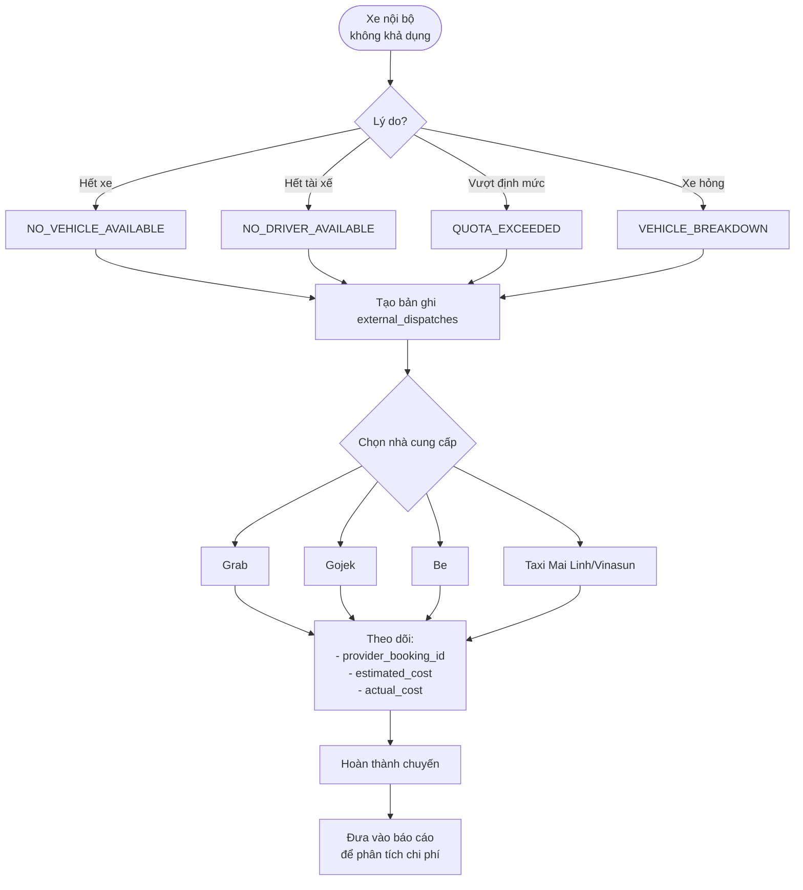
```mermaid
flowchart TD
    START([Xe nội bộ<br/>không khả dụng]) --> REASON{Lý do?}

    REASON -->|Hết xe| R1[NO_VEHICLE_AVAILABLE]
    REASON -->|Hết tài xế| R2[NO_DRIVER_AVAILABLE]
    REASON -->|Vượt định mức| R3[QUOTA_EXCEEDED]
    REASON -->|Xe hỏng| R4[VEHICLE_BREAKDOWN]

    R1 --> CREATE
    R2 --> CREATE
    R3 --> CREATE
    R4 --> CREATE

    CREATE[Tạo bản ghi external_dispatches]

    CREATE --> SELECT{Chọn nhà cung cấp}

    SELECT --> GRAB[Grab]
    SELECT --> GOJEK[Gojek]
    SELECT --> BE[Be]
    SELECT --> TAXI[Taxi Mai Linh/Vinasun]

    GRAB --> TRACK
    GOJEK --> TRACK
    BE --> TRACK
    TAXI --> TRACK

    TRACK[Theo dõi:<br/>- provider_booking_id<br/>- estimated_cost<br/>- actual_cost]

    TRACK --> COMPLETE[Hoàn thành chuyến]
    COMPLETE --> REPORT[Đưa vào báo cáo<br/>để phân tích chi phí]
```

**Cơ sở dữ liệu:** `external_dispatches` liên kết với `bookings` có trạng thái `REDIRECTED_EXTERNAL`

---

## 8. Xác thực & SSO

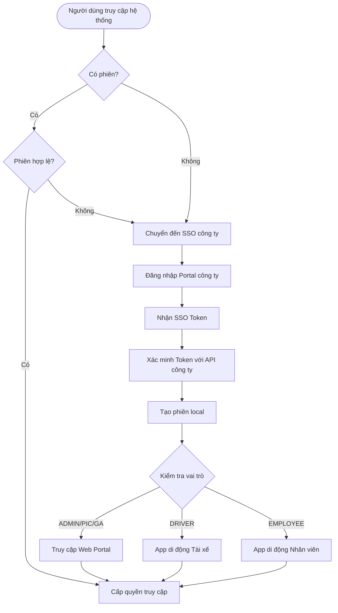
```mermaid
flowchart TD
    START([Người dùng truy cập hệ thống]) --> CHECK{Có phiên?}

    CHECK -->|Có| VALID{Phiên hợp lệ?}
    CHECK -->|Không| SSO[Chuyển đến SSO công ty]

    VALID -->|Có| ACCESS[Cấp quyền truy cập]
    VALID -->|Không| SSO

    SSO --> LOGIN[Đăng nhập Portal công ty]
    LOGIN --> TOKEN[Nhận SSO Token]
    TOKEN --> VERIFY[Xác minh Token với API công ty]
    VERIFY --> CREATE[Tạo phiên local]
    CREATE --> ROLE{Kiểm tra vai trò}

    ROLE -->|ADMIN/PIC/GA| WEB[Truy cập Web Portal]
    ROLE -->|DRIVER| MOBILE_D[App di động Tài xế]
    ROLE -->|EMPLOYEE| MOBILE_E[App di động Nhân viên]

    WEB --> ACCESS
    MOBILE_D --> ACCESS
    MOBILE_E --> ACCESS
```

**Cơ sở dữ liệu:** bảng `users` lưu vai trò, liên kết SSO công ty qua email

---

## 9. Cấu hình hệ thống

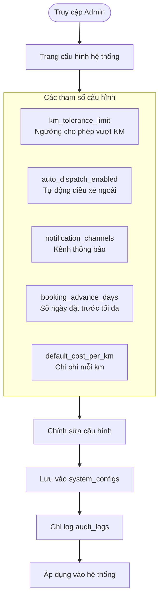
```mermaid
flowchart TD
    ADMIN([Truy cập Admin]) --> CONFIG[Trang cấu hình hệ thống]

    CONFIG --> PARAMS

    subgraph PARAMS["Các tham số cấu hình"]
        P1[km_tolerance_limit<br/>Ngưỡng cho phép vượt KM]
        P2[auto_dispatch_enabled<br/>Tự động điều xe ngoài]
        P3[notification_channels<br/>Kênh thông báo]
        P4[booking_advance_days<br/>Số ngày đặt trước tối đa]
        P5[default_cost_per_km<br/>Chi phí mỗi km]
    end

    PARAMS --> EDIT[Chỉnh sửa cấu hình]
    EDIT --> SAVE[Lưu vào system_configs]
    SAVE --> AUDIT[Ghi log audit_logs]
    AUDIT --> APPLY[Áp dụng vào hệ thống]
```

**Cơ sở dữ liệu:** bảng `system_configs` với giá trị JSONB
```json
{
  "km_tolerance_limit": 50,
  "auto_dispatch_enabled": true,
  "notification_channels": ["APP_PUSH", "AUTO_CALL"],
  "booking_advance_days": 30,
  "default_cost_per_km": 5000
}
```

---

## 10. Quản lý hồ sơ đội xe

### 10.1 Thao tác CRUD xe

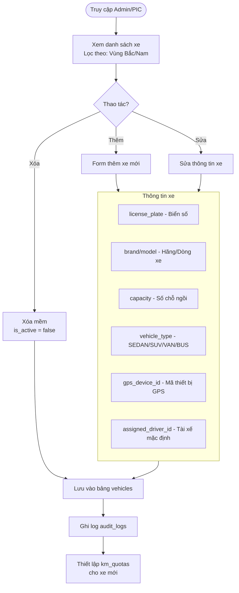
```mermaid
flowchart TD
    START([Truy cập Admin/PIC]) --> LIST[Xem danh sách xe<br/>Lọc theo: Vùng Bắc/Nam]

    LIST --> ACTION{Thao tác?}

    ACTION -->|Thêm| ADD[Form thêm xe mới]
    ACTION -->|Sửa| EDIT[Sửa thông tin xe]
    ACTION -->|Xóa| DEL[Xóa mềm<br/>is_active = false]

    ADD --> FORM
    EDIT --> FORM

    subgraph FORM["Thông tin xe"]
        F1[license_plate - Biển số]
        F2[brand/model - Hãng/Dòng xe]
        F3[capacity - Số chỗ ngồi]
        F4[vehicle_type - SEDAN/SUV/VAN/BUS]
        F5[gps_device_id - Mã thiết bị GPS]
        F6[assigned_driver_id - Tài xế mặc định]
    end

    FORM --> SAVE[Lưu vào bảng vehicles]
    DEL --> SAVE
    SAVE --> AUDIT[Ghi log audit_logs]
    AUDIT --> QUOTA[Thiết lập km_quotas<br/>cho xe mới]
```

### 10.2 Lịch/Timeline của xe

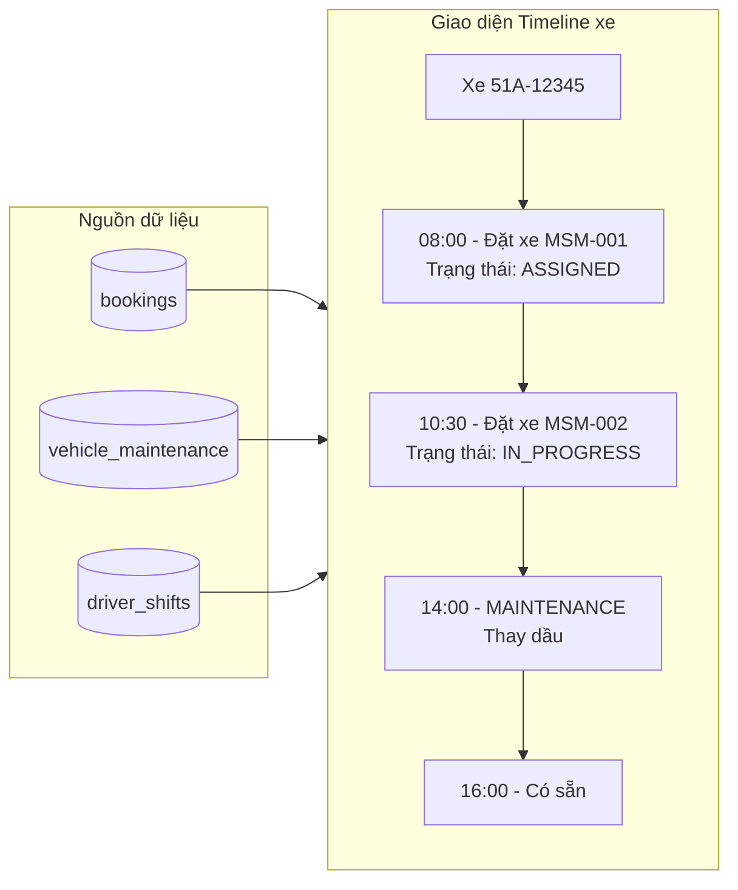
```mermaid
flowchart LR
    subgraph Calendar["Giao diện Timeline xe"]
        direction TB
        V1["Xe 51A-12345"]
        T1[08:00 - Đặt xe MSM-001<br/>Trạng thái: ASSIGNED]
        T2[10:30 - Đặt xe MSM-002<br/>Trạng thái: IN_PROGRESS]
        T3[14:00 - MAINTENANCE<br/>Thay dầu]
        T4[16:00 - Có sẵn]

        V1 --> T1 --> T2 --> T3 --> T4
    end

    subgraph Data["Nguồn dữ liệu"]
        B[(bookings)]
        M[(vehicle_maintenance)]
        S[(driver_shifts)]
    end

    B --> Calendar
    M --> Calendar
    S --> Calendar
```

**Truy vấn:** Join `bookings` + `vehicle_maintenance` + `driver_shifts` theo ngày/giờ

---

## 11. Xem lại lộ trình GPS

```mermaid
flowchart TD
    START([PIC chọn xe]) --> RANGE[Chọn khoảng ngày/giờ]

    RANGE --> QUERY[Truy vấn gps_locations<br/>WHERE vehicle_id AND recorded_at BETWEEN]

    QUERY --> DATA[(Điểm dữ liệu GPS)]

    DATA --> PROCESS[Xử lý dữ liệu lộ trình]

    subgraph PLAYBACK["Tính năng phát lại"]
        MAP[Hiển thị trên bản đồ]
        SPEED[Hiện tốc độ tại mỗi điểm]
        STOPS[Đánh dấu các điểm dừng]
        TIMELINE[Thanh điều khiển Timeline]
    end

    PROCESS --> MAP
    PROCESS --> SPEED
    PROCESS --> STOPS
    PROCESS --> TIMELINE

    subgraph Controls["Điều khiển phát lại"]
        PLAY[Phát/Tạm dừng]
        SEEK[Tua đến thời điểm]
        RATE[Tốc độ phát 1x/2x/4x]
    end

    TIMELINE --> PLAY
    TIMELINE --> SEEK
    TIMELINE --> RATE
```

**Cơ sở dữ liệu:** `gps_locations` phân vùng theo tháng để truy vấn lịch sử hiệu quả

---

## 12. Hủy đặt xe

```mermaid
flowchart TD
    START([Yêu cầu hủy]) --> WHO{Ai hủy?}

    WHO -->|Người dùng| USER[Người dùng hủy đặt xe của mình]
    WHO -->|Admin/PIC| ADMIN[Admin hủy bất kỳ đặt xe]

    USER --> REASON
    ADMIN --> REASON

    subgraph REASON["Chọn lý do hủy"]
        R1[USER_REQUEST - Người dùng hủy]
        R2[NO_VEHICLE_AVAILABLE - Hết xe]
        R3[NO_DRIVER_AVAILABLE - Hết tài xế]
        R4[QUOTA_EXCEEDED - Vượt hạn mức]
        R5[VEHICLE_BREAKDOWN - Xe hỏng]
        R6[SCHEDULE_CONFLICT - Trùng lịch]
        R7[WEATHER - Thời tiết xấu]
        R8[EMERGENCY - Khẩn cấp]
        R9[DUPLICATE - Trùng lặp]
        R10[OTHER - Lý do khác]
    end

    REASON --> UPDATE[Cập nhật đặt xe]

    subgraph UPDATE_FIELDS["Các trường cập nhật"]
        U1[status = CANCELLED]
        U2[cancelled_at = NOW]
        U3[cancelled_by = user_id]
        U4[cancellation_reason = đã chọn]
    end

    UPDATE --> RELEASE[Giải phóng xe & Tài xế]
    RELEASE --> NOTIFY[Gửi thông báo]

    subgraph NOTIFY_TO["Thông báo đến"]
        N1[Người yêu cầu - Đã hủy đặt xe]
        N2[Tài xế - Đã hủy chuyến]
        N3[PIC - Để giám sát]
    end

    NOTIFY --> AUDIT[Ghi log audit_logs]
```

---

## 13. Hệ thống gọi tự động

### 13.1 Tích hợp tổng đài

```mermaid
flowchart LR
    subgraph System["MSM Car Booking"]
        TRIGGER[Sự kiện kích hoạt]
        QUEUE[Hàng chờ cuộc gọi]
        API[Client API Tổng đài]
    end

    subgraph Provider["Nhà cung cấp tổng đài"]
        VOIP[Cổng VoIP]
        TTS[Engine Text-to-Speech]
        CALL[Cuộc gọi đi]
    end

    subgraph User["Người dùng cuối"]
        PHONE[Điện thoại người dùng]
    end

    TRIGGER --> QUEUE
    QUEUE --> API
    API --> VOIP
    VOIP --> TTS
    TTS --> CALL
    CALL --> PHONE
```

### 13.2 Kịch bản gọi tự động

```mermaid
flowchart TD
    subgraph Scenarios["Các tình huống gọi tự động"]
        S1[BOOKING_CONFIRMED<br/>Xác nhận đặt xe]
        S2[VEHICLE_ARRIVING<br/>Xe sắp đến]
        S3[BOOKING_CANCELLED<br/>Hủy chuyến]
    end

    S1 --> BUILD1["Tạo tin nhắn:<br/>Đặt xe thành công.<br/>Xe BIỂN_SỐ sẽ đón bạn<br/>lúc GIỜ ngày NGÀY"]

    S2 --> BUILD2["Tạo tin nhắn:<br/>Xe BIỂN_SỐ của tài xế TÊN<br/>sẽ đến trong 5 phút"]

    S3 --> BUILD3["Tạo tin nhắn:<br/>Chuyến xe của bạn đã bị hủy.<br/>Lý do: LÝ_DO"]

    BUILD1 --> TTS
    BUILD2 --> TTS
    BUILD3 --> TTS

    subgraph TTS["Xử lý Text-to-Speech"]
        CONVERT[Chuyển văn bản thành giọng nói<br/>Giọng tiếng Việt]
        AUDIO[Tạo file âm thanh]
    end

    TTS --> CONVERT --> AUDIO

    AUDIO --> DIAL[Gọi điện thoại người dùng]
    DIAL --> PLAY[Phát tin nhắn âm thanh]
    PLAY --> LOG[Ghi kết quả cuộc gọi<br/>vào bảng notifications]

    subgraph CallStatus["Trạng thái cuộc gọi"]
        CS1[SENT - Đã khởi tạo cuộc gọi]
        CS2[DELIVERED - Người dùng đã nghe]
        CS3[FAILED - Không trả lời/bận]
    end

    LOG --> CS1
    LOG --> CS2
    LOG --> CS3
```

### 13.3 Các biến Text-to-Speech

| Biến | Nguồn | Ví dụ |
|------|-------|-------|
| `BIỂN_SỐ` | `vehicles.license_plate` | 51A-12345 |
| `TÊN` | `users.full_name` (tài xế) | Nguyễn Văn A |
| `GIỜ` | `bookings.scheduled_time` | 08:30 |
| `NGÀY` | `bookings.scheduled_date` | 15/02/2026 |
| `LÝ_DO` | `bookings.cancellation_reason` | Người dùng hủy |

**Cơ sở dữ liệu:** `notifications` với `channel = AUTO_CALL`

---

## Xác minh Cơ sở dữ liệu - Yêu cầu (Tất cả 28 yêu cầu)

| STT | Yêu cầu | Phần luồng | Hỗ trợ CSDL | Trạng thái |
|-----|---------|------------|-------------|------------|
| 1 | Khảo sát & Thiết kế tích hợp | N/A (Giai đoạn dự án) | - | ➖ |
| 2 | SSO | Phần 8 | `users` liên kết SSO công ty | ✅ |
| 3 | Quản lý người dùng | Phần 5.1 | `users`, `departments` | ✅ |
| 4 | Phân quyền | Phần 5.1 | enum `users.role` | ✅ |
| 5 | Cấu hình tham số | Phần 9 | JSONB `system_configs` | ✅ |
| 6 | Báo cáo tổng hợp chi phí | Phần 6.1 | `trip_reports`, `external_dispatches` | ✅ |
| 7 | Báo cáo tổng số km | Phần 6.1 | `trip_reports.total_km`, `km_quotas` | ✅ |
| 8 | Báo cáo lịch sử chuyến đi | Phần 6.1 | `trip_reports`, `bookings` | ✅ |
| 9 | Danh sách xe | Phần 10.1 | `vehicles` với bộ lọc | ✅ |
| 10 | Thêm/sửa/xóa xe | Phần 10.1 | CRUD `vehicles` + `audit_logs` | ✅ |
| 11 | Thiết lập định mức | Phần 2 | bảng `km_quotas` | ✅ |
| 12 | Trạng thái xe | Phần 3.2 | enum `vehicles.status` | ✅ |
| 13 | Xem vị trí hiện tại | Phần 3.1 | `gps_locations` thời gian thực | ✅ |
| 14 | Xem lại lộ trình | Phần 11 | `gps_locations` phân vùng | ✅ |
| 15 | Quản lý điểm đón | Phần 1.3 | `pickup_points` CỐ ĐỊNH/LINH HOẠT | ✅ |
| 16 | Lịch của từng xe | Phần 10.2 | `bookings` + `vehicle_maintenance` | ✅ |
| 17 | Thuật toán matching xe | Phần 1.4 | Thuật toán tính điểm có trọng số | ✅ |
| 18 | Cảnh báo vượt hạn mức | Phần 2.1 | `km_quotas` + logic cảnh báo | ✅ |
| 19 | Form đặt xe | Phần 1.2 | bảng `bookings` | ✅ |
| 20 | Thêm điểm dừng | Phần 1.3 | `trip_stops` với `stop_order` | ✅ |
| 21 | Block lịch | Phần 1.2 | `booking_type = BLOCK_SCHEDULE` | ✅ |
| 22 | Huỷ đặt xe | Phần 12 | các trường hủy `bookings` | ✅ |
| 23 | Hàng chờ thuê ngoài | Phần 7 | hàng chờ `external_dispatches` | ✅ |
| 24 | Ghi nhận thông tin | Phần 7 | chi tiết `external_dispatches` | ✅ |
| 25 | Cập nhật trạng thái | Phần 7 | `notifications` đến người dùng | ✅ |
| 26 | Cổng kết nối tổng đài | Phần 13.1 | `notifications.channel = AUTO_CALL` | ✅ |
| 27 | Kịch bản gọi tự động | Phần 13.2 | trigger `notification_type` | ✅ |
| 28 | Text-to-Speech | Phần 13.3 | Các biến tin nhắn động | ✅ |

### Tổng kết

- **Tổng số yêu cầu:** 28
- **Đã đáp ứng:** 27 ✅
- **Không áp dụng:** 1 ➖ (Giai đoạn phân tích dự án)
- **Độ bao phủ:** 100%
