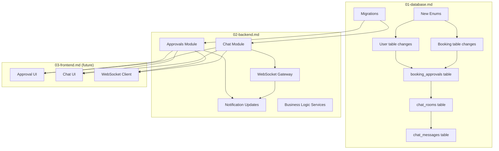

# Implementation Plan: Booking Approval Workflow & In-App Chat System

**Document ID:** PLAN-20260202-001
**Created:** 2026-02-02
**Status:** Draft
**Estimated Effort:** 15-20 days (Backend: 10-12 days, Frontend: 8-10 days, Testing: 5-7 days)

---

## Executive Summary

This plan covers two major feature additions to the MSM Car Booking system:

1. **Booking Approval Workflow** - Different approval flows based on user type and position level
2. **In-App Chat System** - Real-time communication between employees and drivers for schedule changes

---

## Feature 1: Booking Approval Workflow

### Business Requirements Summary

| User Type | Condition | Approval Flow |
|-----------|-----------|---------------|
| SIC Employees | `user_segment = DAILY` AND business trip | **No approval required** - CC (copy) to line manager only |
| Other Employees | `user_segment = SOMETIMES` OR non-business trip | **Manager approval required** first, then to system |
| Management Level | `position_level >= MGR` | **No approval required** - Auto-accept |

### Key Components

1. **New `position_level` field on users** - To identify management level (MGR and above)
2. **New `booking_approvals` table** - Track approval requests, status, and history
3. **New `PENDING_APPROVAL` booking status** - Before PENDING (awaiting confirmation)
4. **Approval reminder notifications** - Auto-remind approvers if pending too long
5. **Business logic to determine approval flow** - Based on user segment, position, and trip type

---

## Feature 2: In-App Chat System

### Business Requirements Summary

For BLOCK_SCHEDULE bookings (fixed route shuttles), enable communication between employee and driver when:
- Employee will return late (notify driver of new return time)
- Departure time changes (early or late)

### Key Components

1. **New `chat_rooms` table** - Chat rooms linked to bookings
2. **New `chat_messages` table** - Individual messages with sender/recipient
3. **WebSocket gateway** - Real-time message delivery
4. **Push notifications** - Alert for new messages
5. **Trigger mechanism** - Auto-create chat room for BLOCK_SCHEDULE bookings

---

## Domain Dependencies

---

## Plan Files

| File | Description | Domain |
|------|-------------|--------|
| `00-overview.md` | This file - Summary and dependencies | All |
| `01-database.md` | Schema changes, migrations, enums | Database |
| `02-backend.md` | NestJS modules, services, controllers, WebSocket | Backend |
| `03-testing.md` | Test strategy and test cases | Testing |

---

## Implementation Order

### Phase 1: Database Foundation (Day 1-2)
- [ ] Add new enums to TypeORM
- [ ] Update User entity with position_level
- [ ] Update Booking entity with new status
- [ ] Create BookingApproval entity
- [ ] Create ChatRoom entity
- [ ] Create ChatMessage entity
- [ ] Generate and run migrations
- [ ] Update seed data

### Phase 2: Approval Workflow Backend (Day 3-6)
- [ ] Create Approvals module structure
- [ ] Implement ApprovalService with business logic
- [ ] Create ApprovalsController with endpoints
- [ ] Update BookingsService to integrate approval workflow
- [ ] Create approval reminder job (Bull queue or cron)
- [ ] Add new notification types for approvals
- [ ] Write unit tests

### Phase 3: Chat System Backend (Day 7-10)
- [ ] Install @nestjs/websockets and socket.io dependencies
- [ ] Create Chat module structure
- [ ] Create ChatGateway (WebSocket)
- [ ] Implement ChatService
- [ ] Create ChatController for REST fallback
- [ ] Add chat room auto-creation for BLOCK_SCHEDULE
- [ ] Add new notification types for chat
- [ ] Write unit tests

### Phase 4: Integration & Testing (Day 11-13)
- [ ] Integration testing between modules
- [ ] E2E testing for approval flows
- [ ] E2E testing for chat functionality
- [ ] Performance testing for WebSocket
- [ ] Documentation updates

---

## Risk Assessment

| Risk | Impact | Mitigation |
|------|--------|------------|
| WebSocket scalability | Medium | Use Redis adapter for socket.io in production |
| Approval reminder spam | Low | Implement cooldown period and max reminders |
| Chat message persistence | Medium | Ensure proper message ordering and delivery confirmation |
| Position level data migration | Low | Default existing users to appropriate level |

---

## Success Criteria

1. **Approval Workflow**
   - [ ] SIC employees can create bookings with automatic CC to manager
   - [ ] Regular employees must wait for manager approval
   - [ ] Managers and above can create bookings directly
   - [ ] Approvers receive reminders for pending approvals
   - [ ] All approval actions are audit-logged

2. **Chat System**
   - [ ] Chat rooms auto-created for BLOCK_SCHEDULE bookings
   - [ ] Real-time message delivery via WebSocket
   - [ ] Offline message queuing with push notifications
   - [ ] Message history persisted and retrievable

---

## Related Documents

- [System Workflows](../../docs-site/docs/system-workflows.md)
- [Business Flows](../../docs-site/docs/business-flows.md)
- [Database Models](../../docs-site/docs/database-models.mdx)
